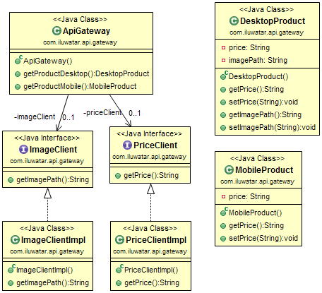

#

# S.O.L.I.D

* **Single responsibility principle** - A class should have only a single responsibility.

* **Open/Closed principle - A class should be open for extension but closed for modification.

* **Liskov Substitution Principle** - A type must be substitutable by its subtypes without altering the correctness of the application.

* **Interface Segregation Principle** - Clients of a class should not be forced to depend on those of its methods that they don’t use.

* **Dependency inversion principle** - High-level classes should not dependent on low-level classes. Both of them should depend on abstractions. Abstractions should not depend upon details. Details should depend upon abstractions.

# Applied Anti-SOLID and SOLID Principles
### Code Samples and UML Class Diagrams
-----------
#### S - Single Responsibility Principle (SRP) <br />
A class should have only a single responsibility.<br /><br />


------

#### O - Open/Closed Principle (OCP) <br />
A class should be open for extension but closed for modification. <br /><br />


-----

#### L - Liskov’s Substitution Principle (LSP) <br />
A type must be substitutable by its subtypes without altering the correctness of the application. <br /><br />


----

#### I - Interface Segregation Principle (ISP) <br />
Clients of a class should not be forced to depend on those of its methods that they don’t use.<br /><br />


-----

#### D - Dependency Inversion Principle (DIP)<br />
High-level classes should not dependent on low-level classes. Both of them should depend on abstractions.<br />
Abstractions should not depend upon details. Details should depend upon
abstractions.<br />


--------

### SOLID Short Control List
- Do methods in the class have similar responsibilities? (SRP)
- Are there any method in the class that functions different based on different variables? (OCP)
- Are there any functionless methods/properties which comes from base class/interface in your derived classes? (LSP & ISP)
- Are there initiations of non-abstract objects in a high-level class? (DIP)

-------------

<br /><br /><br /><br /><br /><br /><br /><br />

-------------

# Design Patterns

### **Architectural Pattern**
> An **_architectural pattern_** is a general, reusable solution to a commonly occurring problem in software architecture within a given context. Architectural patterns are similar to software design pattern but have a broader scope.
>

| Pattern | Categories |
| :-- | :-- |
| [API Gateway](#api-gateway) |     |
| [Aggregator Microservices](#aggregator-microservices) |     |
| [CQRS](#cqrs) |    |
| [Data Access Object](#data-access-object) |   |
| [Data Bus](#data-bus) |   |
| [Data Mapper](#data-mapper) |   |
| [Data Transfer Object](#data-transfer-object) |   |
| [Domain Model](#domain-model) |   |
| [Event Driven Architecture](#event-driven-architecture) |   |
| [Event Sourcing](#event-sourcing) |    |
| [Hexagonal Architecture](#hexagonal-architecture) |   |
| [Layers](#layers) |   |
| [Model-View-Controller](#model-view-controller) |   |
| [Model-View-Presenter](#model-view-presenter) |   |
| [Model-View-ViewModel](#model-view-viewmodel) |   |
| [Naked-Objects](#naked-objects) |   |
| [Repository](#repository) |   |
| [Serverless](#serverless) |   |
| [Service Layer](#service-layer) |   |
| [Service Locator](#service-locator) |    |
| [Unit Of Work](#unit-of-work) |    |

#### API Gateway
   
---
##### Intent
Aggregate calls to microservices in a single location, the API Gateway. The user makes a single call to the API Gateway, and the API Gateway then calls each relevant microservice.

##### Explanation
With the Microservices pattern, a client may need data from multiple different microservices. If the client called each microservice directly, that could contribute to longer load times, since the client would have to make a network request for each microservice called. Moreover, having the client call each microservice directly ties the client to that microservice - if the internal implementations of the microservices change (for example, if two microservices are combined sometime in the future) or if the location (host and port) of a microservice changes, then every client that makes use of those microservices must be updated.

The intent of the API Gateway pattern is to alleviate some of these issues. In the API Gateway pattern, an additional entity (the API Gateway) is placed between the client and the microservices. The job of the API Gateway is to aggregate the calls to the microservices. Rather than the client calling each microservice individually, the client calls the API Gateway a single time. The API Gateway then calls each of the microservices that the client needs.

Real world example
> We are implementing microservices and API Gateway pattern for an e-commerce site. In this system the API Gateway makes calls to the Image and Price microservices.
>

In plain words

For a system implemented using microservices architecture, API Gateway is the single entry point that aggregates the calls to the individual microservices.

Wikipedia says

> API Gateway is a server that acts as an API front-end, receives API requests, enforces throttling and security policies, passes requests to the back-end service and then passes the response back to the requester. A gateway often includes a transformation engine to orchestrate and modify the requests and responses on the fly. A gateway can also provide functionality such as collecting analytics data and providing caching. The gateway can provide functionality to support authentication, authorization, security, audit and regulatory compliance.
>

**Programmatic Example**

This implementation shows what the API Gateway pattern could look like for an e-commerce site. The `ApiGateway` makes calls to the Image and Price microservices using the `ImageClientImpl` and `PriceClientImpl` respectively. Customers viewing the site on a desktop device can see both price information and an image of a product, so the `ApiGateway` calls both of the microservices and aggregates the data in the `DesktopProduct` model. However, mobile users only see price information; they do not see a product image. For mobile users, the `ApiGateway` only retrieves price information, which it uses to populate the `MobileProduct`.

Here's the Image microservice implementation.

```java
public interface ImageClient {
  String getImagePath();
}

public class ImageClientImpl implements ImageClient {
  @Override
  public String getImagePath() {
    var httpClient = HttpClient.newHttpClient();
    var httpGet = HttpRequest.newBuilder()
        .GET()
        .uri(URI.create("http://localhost:50005/image-path"))
        .build();

    try {
      var httpResponse = httpClient.send(httpGet, BodyHandlers.ofString());
      return httpResponse.body();
    } catch (IOException | InterruptedException e) {
      e.printStackTrace();
    }

    return null;
  }
}
```

Here's the Price microservice implementation.

```java
public interface PriceClient {
  String getPrice();
}

public class PriceClientImpl implements PriceClient {

  @Override
  public String getPrice() {
    var httpClient = HttpClient.newHttpClient();
    var httpGet = HttpRequest.newBuilder()
        .GET()
        .uri(URI.create("http://localhost:50006/price"))
        .build();

    try {
      var httpResponse = httpClient.send(httpGet, BodyHandlers.ofString());
      return httpResponse.body();
    } catch (IOException | InterruptedException e) {
      e.printStackTrace();
    }

    return null;
  }
}
```

Here we can see how API Gateway maps the requests to the microservices.

```java
public class ApiGateway {

  @Resource
  private ImageClient imageClient;

  @Resource
  private PriceClient priceClient;

  @RequestMapping(path = "/desktop", method = RequestMethod.GET)
  public DesktopProduct getProductDesktop() {
    var desktopProduct = new DesktopProduct();
    desktopProduct.setImagePath(imageClient.getImagePath());
    desktopProduct.setPrice(priceClient.getPrice());
    return desktopProduct;
  }

  @RequestMapping(path = "/mobile", method = RequestMethod.GET)
  public MobileProduct getProductMobile() {
    var mobileProduct = new MobileProduct();
    mobileProduct.setPrice(priceClient.getPrice());
    return mobileProduct;
  }
}
```

##### Class Diagram


##### Applicability
Use the API Gateway pattern when

* You're using microservices architecture and need a single point of aggregation for your microservice calls.

#### Aggregator Microservices
   
---
##### Intent
The user makes a single call to the aggregator service, and the aggregator then calls each relevant microservice.

##### Explanation
Real world example
> Our web marketplace needs information about products and their current inventory. It makes a call to an aggregator service which in turn calls the product information microservice and product inventory microservice returning the combined information.
>

In plain words
> Aggregator Microservice collects pieces of data from various microservices and returns an aggregate for processing.
>

Stack Overflow says
> Aggregator Microservice invokes multiple services to achieve the functionality required by the application.
>

**Programmatic Example**
Let's start from the data model. Here's our `Product`.
```java
public class Product {
  private String title;
  private int productInventories;
  // getters and setters ->
  ...
}
```

Next we can introduce our `Aggregator` microservice. It contains clients `ProductInformationClient` and `ProductInventoryClient` for calling respective microservices.

```java
@RestController
public class Aggregator {

  @Resource
  private ProductInformationClient informationClient;

  @Resource
  private ProductInventoryClient inventoryClient;

  @RequestMapping(path = "/product", method = RequestMethod.GET)
  public Product getProduct() {

    var product = new Product();
    var productTitle = informationClient.getProductTitle();
    var productInventory = inventoryClient.getProductInventories();

    //Fallback to error message
    product.setTitle(requireNonNullElse(productTitle, "Error: Fetching Product Title Failed"));

    //Fallback to default error inventory
    product.setProductInventories(requireNonNullElse(productInventory, -1));

    return product;
  }
}
```

Here's the essence of information microservice implementation. Inventory microservice is similar, it just returns inventory counts.

```java
@RestController
public class InformationController {
  @RequestMapping(value = "/information", method = RequestMethod.GET)
  public String getProductTitle() {
    return "The Product Title.";
  }
}
```

Now calling our `Aggregator` REST API returns the product information.

```bash
curl http://localhost:50004/product {"title":"The Product Title.","productInventories":5}
```

##### Class diagram


##### Applicability
Use the Aggregator Microservices pattern when you need a unified API for various microservices, regardless the client device.

#### CQRS
  
---
##### Intent
CQRS Command Query Responsibility Segregation - Separate the query side from the command side.

##### Class Diagram


##### Applicability
Use the CQRS pattern when

* You want to scale the queries and commands independently.
* You want to use different data models for queries and commands. Useful when dealing with complex domains.
* You want to use architectures like event sourcing or task based UI.

#### Data Access Object
 
---
##### Intent
Object provides an abstract interface to some type of database or other persistence mechanism.

##### Explanation
Real world example

> There's a set of customers that need to be persisted to database. Additionally we need the whole set of CRUD (create/read/update/delete) operations so we can operate on customers easily.
>

In plain words

> DAO is an interface we provide over the base persistence mechanism.
>

Wikipedia says

> In computer software, a data access object (DAO) is a pattern that provides an abstract interface to some type of database or other persistence mechanism.
>

**Programmatic Example**

Walking through our customers example, here's the basic `Customer` entity.

```java
public class Customer {

  private int id;
  private String firstName;
  private String lastName;

  public Customer(int id, String firstName, String lastName) {
    this.id = id;
    this.firstName = firstName;
    this.lastName = lastName;
  }
  // getters and setters ->
  ...
}
```

Here's the `CustomerDao` interface and two different implementations for it. `InMemoryCustomerDao` keeps a simple map of customers in memory while `DBCustomerDao` is the real RDBMS implementation.

```java
public interface CustomerDao {

  Stream<Customer> getAll() throws Exception;

  Optional<Customer> getById(int id) throws Exception;

  boolean add(Customer customer) throws Exception;

  boolean update(Customer customer) throws Exception;

  boolean delete(Customer customer) throws Exception;
}

public class InMemoryCustomerDao implements CustomerDao {

  private final Map<Integer, Customer> idToCustomer = new HashMap<>();

  // implement the interface using the map
  ...
}

@Slf4j
public class DbCustomerDao implements CustomerDao {

  private final DataSource dataSource;

  public DbCustomerDao(DataSource dataSource) {
    this.dataSource = dataSource;
  }

  // implement the interface using the data source
  ...
```

Finally here's how we use our DAO to manage customers.

```java
    final var dataSource = createDataSource();
    createSchema(dataSource);
    final var customerDao = new DbCustomerDao(dataSource);
    
    addCustomers(customerDao);
    log.info(ALL_CUSTOMERS);
    try (var customerStream = customerDao.getAll()) {
      customerStream.forEach((customer) -> log.info(customer.toString()));
    }
    log.info("customerDao.getCustomerById(2): " + customerDao.getById(2));
    final var customer = new Customer(4, "Dan", "Danson");
    customerDao.add(customer);
    log.info(ALL_CUSTOMERS + customerDao.getAll());
    customer.setFirstName("Daniel");
    customer.setLastName("Danielson");
    customerDao.update(customer);
    log.info(ALL_CUSTOMERS);
    try (var customerStream = customerDao.getAll()) {
      customerStream.forEach((cust) -> log.info(cust.toString()));
    }
    customerDao.delete(customer);
    log.info(ALL_CUSTOMERS + customerDao.getAll());
    
    deleteSchema(dataSource);
```

The program output:

```
customerDao.getAllCustomers(): 
Customer{id=1, firstName='Adam', lastName='Adamson'}
Customer{id=2, firstName='Bob', lastName='Bobson'}
Customer{id=3, firstName='Carl', lastName='Carlson'}
customerDao.getCustomerById(2): Optional[Customer{id=2, firstName='Bob', lastName='Bobson'}]
customerDao.getAllCustomers(): java.util.stream.ReferencePipeline$Head@7cef4e59
customerDao.getAllCustomers(): 
Customer{id=1, firstName='Adam', lastName='Adamson'}
Customer{id=2, firstName='Bob', lastName='Bobson'}
Customer{id=3, firstName='Carl', lastName='Carlson'}
Customer{id=4, firstName='Daniel', lastName='Danielson'}
customerDao.getAllCustomers(): java.util.stream.ReferencePipeline$Head@2db0f6b2
customerDao.getAllCustomers(): 
Customer{id=1, firstName='Adam', lastName='Adamson'}
Customer{id=2, firstName='Bob', lastName='Bobson'}
Customer{id=3, firstName='Carl', lastName='Carlson'}
customerDao.getCustomerById(2): Optional[Customer{id=2, firstName='Bob', lastName='Bobson'}]
customerDao.getAllCustomers(): java.util.stream.ReferencePipeline$Head@12c8a2c0
customerDao.getAllCustomers(): 
Customer{id=1, firstName='Adam', lastName='Adamson'}
Customer{id=2, firstName='Bob', lastName='Bobson'}
Customer{id=3, firstName='Carl', lastName='Carlson'}
Customer{id=4, firstName='Daniel', lastName='Danielson'}
customerDao.getAllCustomers(): java.util.stream.ReferencePipeline$Head@6ec8211c
```

##### Class Diagram


##### Applicability
Use the Data Access Object in any of the following situations:
  * When you want to consolidate how the data layer is accessed.
  * When you want to avoid writing multiple data retrieval/persistence layers.

#### Data Mapper
 
---
##### Intent
A layer of mappers that moves data between objects and a database while keeping them independent of each other and the mapper itself

##### Class Diagram


##### Applicability
Use the Data Mapper in any of the following situations

  * when you want to decouple data objects from DB access layer
  * when you want to write multiple data retrieval/persistence implementations
  
#### Data Transfer Object
 
---
##### Intent
Pass data with multiple attributes in one shot from client to server, to avoid multiple calls to remote server.

##### Explanation
Real world example

> We need to fetch information about customers from remote database. Instead of querying the attributes one at a time, we use DTOs to transfer all the relevant attributes in a single shot.
>

In plain words

> Using DTO relevant information can be fetched with a single backend query.
>

Wikipedia says

> In the field of programming a data transfer object (DTO) is an object that carries data between processes. The motivation for its use is that communication between processes is usually done resorting to remote interfaces (e.g. web services), where each call is an expensive operation. Because the majority of the cost of each call is related to the round-trip time between the client and the server, one way of reducing the number of calls is to use an object (the DTO) that aggregates the data that would have been transferred by the several calls, but that is served by one call only.
>

**Programmatic Example**

Let's first introduce our simple `CustomerDTO` class.

```java
public class CustomerDto {
  private final String id;
  private final String firstName;
  private final String lastName;

  public CustomerDto(String id, String firstName, String lastName) {
    this.id = id;
    this.firstName = firstName;
    this.lastName = lastName;
  }

  public String getId() {
    return id;
  }

  public String getFirstName() {
    return firstName;
  }

  public String getLastName() {
    return lastName;
  }
}
```

`CustomerResource` class acts as the server for customer information.

```java
public class CustomerResource {
  private final List<CustomerDto> customers;

  public CustomerResource(List<CustomerDto> customers) {
    this.customers = customers;
  }

  public List<CustomerDto> getAllCustomers() {
    return customers;
  }

  public void save(CustomerDto customer) {
    customers.add(customer);
  }

  public void delete(String customerId) {
    customers.removeIf(customer -> customer.getId().equals(customerId));
  }
}
```

Now fetching customer information is easy since we have the DTOs.

```java
    var allCustomers = customerResource.getAllCustomers();
    allCustomers.forEach(customer -> LOGGER.info(customer.getFirstName()));
    // Kelly
    // Alfonso
```

##### Class Diagram


##### Applicability
Use the Data Transfer Object pattern when:
  * The client is asking for multiple information. And the information is related.
  * When you want to boost the performance to get resources.
  * You want reduced number of remote calls.

