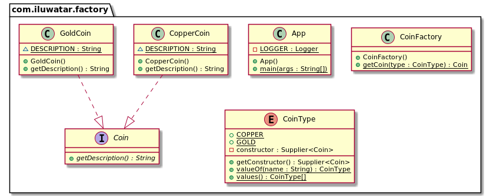
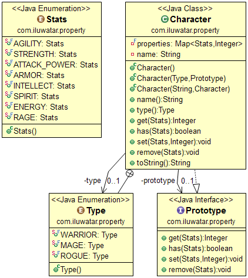
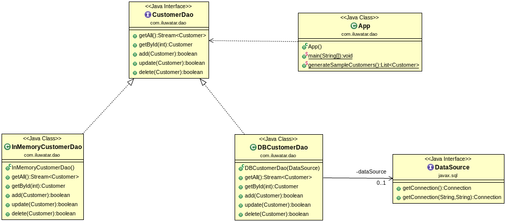
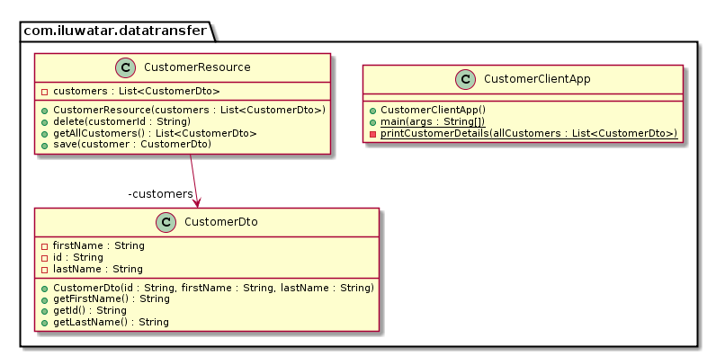
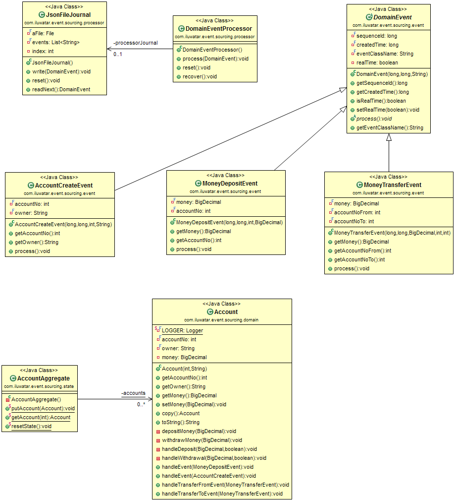
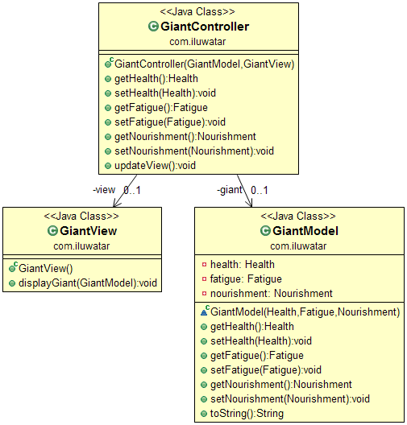
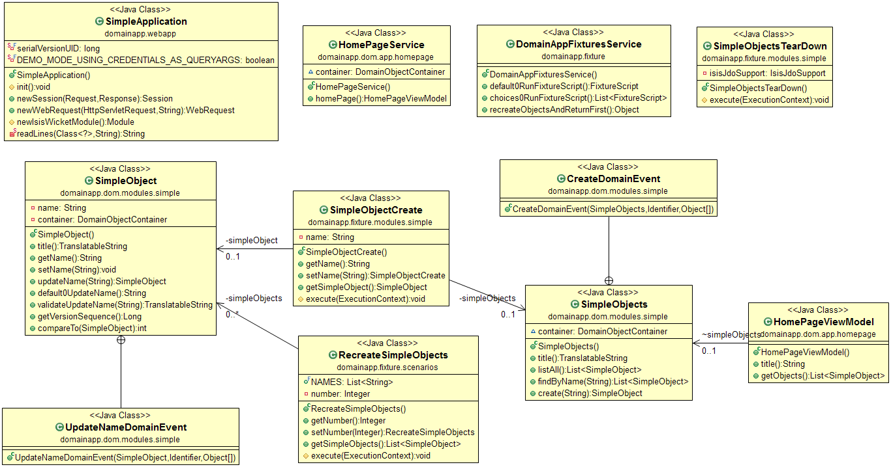

#

# S.O.L.I.D

* **Single responsibility principle** - A class should have only a single responsibility.

* **Open/Closed principle - A class should be open for extension but closed for modification.

* **Liskov Substitution Principle** - A type must be substitutable by its subtypes without altering the correctness of the application.

* **Interface Segregation Principle** - Clients of a class should not be forced to depend on those of its methods that they don’t use.

* **Dependency inversion principle** - High-level classes should not dependent on low-level classes. Both of them should depend on abstractions. Abstractions should not depend upon details. Details should depend upon abstractions.

# Applied Anti-SOLID and SOLID Principles
### Code Samples and UML Class Diagrams
-----------
#### S - Single Responsibility Principle (SRP) <br />
A class should have only a single responsibility.<br /><br />


------

#### O - Open/Closed Principle (OCP) <br />
A class should be open for extension but closed for modification. <br /><br />


-----

#### L - Liskov’s Substitution Principle (LSP) <br />
A type must be substitutable by its subtypes without altering the correctness of the application. <br /><br />


----

#### I - Interface Segregation Principle (ISP) <br />
Clients of a class should not be forced to depend on those of its methods that they don’t use.<br /><br />


-----

#### D - Dependency Inversion Principle (DIP)<br />
High-level classes should not dependent on low-level classes. Both of them should depend on abstractions.<br />
Abstractions should not depend upon details. Details should depend upon
abstractions.<br />


--------

### SOLID Principles Check List
- Do methods in the class have similar responsibilities? (SRP)
- Are there any method in the class that functions different based on different variables? (OCP)
- Are there any functionless methods/properties which comes from base class/interface in your derived classes? (LSP & ISP)
- Are there initiations of non-abstract objects in a high-level class? (DIP)

-------------

<br /><br /><br /><br /><br /><br /><br /><br />

-------------

# Design Patterns

## Introduction

Design patterns are formalized best practices that the programmer can use to solve common problems when designing an application or system.

Design patterns can speed up the development process by providing tested, proven development paradigms.

Reusing design patterns helps to prevent subtle issues that can cause major problems, and it also improves code readability for coders and architects who are familiar with the patterns.

## <a name="list-of-design-patterns">List of Design Patterns</a>

* **Creational Patterns**
  **Creational design patterns** abstract the instantiation process. They help make a system independent of how its objects are created, composed, and represented.

* **Structural Patterns**
  **Structural patterns** are concerned with how classes and objects are composed to form larger structures.

* **Behavioral Patterns**
  **Behavioral patterns** are concerned with algorithms and the assignment of responsibilites between objects.

* **Concurrency Patterns**
  **Concurrency patterns** are those types of design patterns that deal with the multi-threaded programming paradigm.

* **Presentation Tier Patterns**
  **Presentation Tier patterns** are the top-most level of the application, this is concerned with translating tasks and results to something the user can understand.

* **Architectural Patterns**
  An **architectural pattern** is a general, reusable solution to a commonly occurring problem in software architecture within a given context.

* **Integration Patterns**
  **Integration patterns** are concerned with how software applications communicate and exchange data.

### **Creational Pattern**
> A **_creational pattern_** abstracts out the instantiation process. They help make a system independent of how its objects are created, composed, and represented.
>

| Pattern | Categories |
| :-- | :-- |
| [Abstract Factory](#abstract-factory) |   |
| [Builder](#builder) |   |
| [Coverter](#converter) |   |
| [Dependency Injection](#dependency-injection) |   |
| [Factory](#factory) |   |
| [Factory Kit](#factory-kit) |   |
| [Factory Method](#factory-method) |    |
| [Mono State](#mono-state) |   |
| [Multiton](#multiton) |   |
| [Object Mother](#object-mother) |   |
| [Object Pool](#object-pool) |    |
| [Property](#property) |   |
| [Prototype](#prototype) |   |
| [Registry](#registry) |   |
| [Singleton](#singleton) |   |
| [Step Builder](#step-builder) |   |
| [Value Object](#value-object) |   |

#### Abstract Factory
 
---
##### Also known as
Kit

##### Intent
Provide an interface for creating families of related or dependent objects without specifying their concrete classes.

##### Explanation
Real-world example

> To create a kingdom we need objects with a common theme. The elven kingdom needs an elven king, elven castle, and elven army whereas the orcish kingdom needs an orcish king, orcish castle, and orcish army. There is a dependency between the objects in the kingdom.
>

In plain words

> A factory of factories; a factory that groups the individual but related/dependent factories together without specifying their concrete classes.
>

Wikipedia says

> The abstract factory pattern provides a way to encapsulate a group of individual factories that have a common theme without specifying their concrete classes
>

**Programmatic Example**

Translating the kingdom example above. First of all, we have some interfaces and implementation for the objects in the kingdom.

```java
public interface Castle {
  String getDescription();
}

public interface King {
  String getDescription();
}

public interface Army {
  String getDescription();
}

// Elven implementations ->
public class ElfCastle implements Castle {
  static final String DESCRIPTION = "This is the elven castle!";
  @Override
  public String getDescription() {
    return DESCRIPTION;
  }
}
public class ElfKing implements King {
  static final String DESCRIPTION = "This is the elven king!";
  @Override
  public String getDescription() {
    return DESCRIPTION;
  }
}
public class ElfArmy implements Army {
  static final String DESCRIPTION = "This is the elven Army!";
  @Override
  public String getDescription() {
    return DESCRIPTION;
  }
}

// Orcish implementations similarly -> ...
```

Then we have the abstraction and implementations for the kingdom factory.

```java
public interface KingdomFactory {
  Castle createCastle();
  King createKing();
  Army createArmy();
}

public class ElfKingdomFactory implements KingdomFactory {
  public Castle createCastle() {
    return new ElfCastle();
  }
  public King createKing() {
    return new ElfKing();
  }
  public Army createArmy() {
    return new ElfArmy();
  }
}

public class OrcKingdomFactory implements KingdomFactory {
  public Castle createCastle() {
    return new OrcCastle();
  }
  public King createKing() {
    return new OrcKing();
  }
  public Army createArmy() {
    return new OrcArmy();
  }
}
```

Now we have the abstract factory that lets us make a family of related objects i.e. elven kingdom factory creates elven castle, king and army, etc.

```java
var factory = new ElfKingdomFactory();
var castle = factory.createCastle();
var king = factory.createKing();
var army = factory.createArmy();

castle.getDescription();
king.getDescription();
army.getDescription();
```

Program output:

```
This is the elven castle!
This is the elven king!
This is the elven Army!
```

Now, we can design a factory for our different kingdom factories. In this example, we created `FactoryMaker`, responsible for returning an instance of either `ElfKingdomFactory` or `OrcKingdomFactory`.
The client can use `FactoryMaker` to create the desired concrete factory which, in turn, will produce different concrete objects (derived from `Army`, `King`, `Castle`).
In this example, we also used an enum to parameterize which type of kingdom factory the client will ask for.

```java
public static class FactoryMaker {

  public enum KingdomType {
    ELF, ORC
  }

  public static KingdomFactory makeFactory(KingdomType type) {
    switch (type) {
      case ELF:
        return new ElfKingdomFactory();
      case ORC:
        return new OrcKingdomFactory();
      default:
        throw new IllegalArgumentException("KingdomType not supported.");
    }
  }
}

public static void main(String[] args) {
  var app = new App();

  LOGGER.info("Elf Kingdom");
  app.createKingdom(FactoryMaker.makeFactory(KingdomType.ELF));
  LOGGER.info(app.getArmy().getDescription());
  LOGGER.info(app.getCastle().getDescription());
  LOGGER.info(app.getKing().getDescription());

  LOGGER.info("Orc Kingdom");
  app.createKingdom(FactoryMaker.makeFactory(KingdomType.ORC));
  -- similar use of the orc factory
}
```

##### Class Diagram


##### Applicability
Use the Abstract Factory pattern when

  * The system should be independent of how its products are created, composed, and represented
  * The system should be configured with one of the multiple families of products
  * The family of related product objects is designed to be used together, and you need to enforce this constraint
  * You want to provide a class library of products, and you want to reveal just their interfaces, not their implementations
  * The lifetime of the dependency is conceptually shorter than the lifetime of the consumer.
  * You need a run-time value to construct a particular dependency
  * You want to decide which product to call from a family at runtime.
  * You need to supply one or more parameters only known at run-time before you can resolve a dependency.
  * When you need consistency among products
  * You don’t want to change existing code when adding new products or families of products to the program.

Example use cases

  * Selecting to call to the appropriate implementation of FileSystemAcmeService or DatabaseAcmeService or NetworkAcmeService at runtime.
  * Unit test case writing becomes much easier
  * UI tools for different OS

##### Consequences
  * Dependency injection in java hides the service class dependencies that can lead to runtime errors that would have been caught at compile time.
  * While the pattern is great when creating predefined objects, adding the new ones might be challenging.
  * The code becomes more complicated than it should be since a lot of new interfaces and classes are introduced along with the pattern.

##### Tutorials
  * [Abstract Factory Pattern Tutorial](https://www.journaldev.com/1418/abstract-factory-design-pattern-in-java)

##### Known uses
  * [javax.xml.parsers.DocumentBuilderFactory](http://docs.oracle.com/javase/8/docs/api/javax/xml/parsers/DocumentBuilderFactory.html)
  * [javax.xml.transform.TransformerFactory](http://docs.oracle.com/javase/8/docs/api/javax/xml/transform/TransformerFactory.html#newInstance--)
  * [javax.xml.xpath.XPathFactory](http://docs.oracle.com/javase/8/docs/api/javax/xml/xpath/XPathFactory.html#newInstance--)

##### Related patterns
  * [Factory Method](#factory-method)
  * [Factory Kit](#factory-kit)

#### Builder
 
---
##### Intent
Separate the construction of a complex object from its representation so that the same construction process can create different representations.

##### Explanation
Real-world example

> Imagine a character generator for a role-playing game. The easiest option is to let the computer create the character for you. If you want to manually select the character details like profession, gender, hair color, etc. the character generation becomes a step-by-step process that completes when all the selections are ready.
>

In plain words

> Allows you to create different flavors of an object while avoiding constructor pollution. Useful when there could be several flavors of an object. Or when there are a lot of steps involved in creation of an object.
>

Wikipedia says

> The builder pattern is an object creation software design pattern with the intentions of finding a solution to the telescoping constructor anti-pattern.
>

Having said that let me add a bit about what telescoping constructor anti-pattern is. At one point or the other, we have all seen a constructor like below:

```java
public Hero(Profession profession, String name, HairType hairType, HairColor hairColor, Armor armor, Weapon weapon) {
}
```

As you can see the number of constructor parameters can quickly get out of hand, and it may become difficult to understand the arrangement of parameters. Plus this parameter list could keep on growing if you would want to add more options in the future. This is called **telescoping constructor anti-pattern**.

**Programmatic Example**

The sane alternative is to use the Builder pattern. First of all, we have our hero that we want to create:

```java
public final class Hero {
  private final Profession profession;
  private final String name;
  private final HairType hairType;
  private final HairColor hairColor;
  private final Armor armor;
  private final Weapon weapon;

  private Hero(Builder builder) {
    this.profession = builder.profession;
    this.name = builder.name;
    this.hairColor = builder.hairColor;
    this.hairType = builder.hairType;
    this.weapon = builder.weapon;
    this.armor = builder.armor;
  }
}
```

Then we have the builder:

```java
  public static class Builder {
    private final Profession profession;
    private final String name;
    private HairType hairType;
    private HairColor hairColor;
    private Armor armor;
    private Weapon weapon;

    public Builder(Profession profession, String name) {
      if (profession == null || name == null) {
        throw new IllegalArgumentException("profession and name can not be null");
      }
      this.profession = profession;
      this.name = name;
    }

    public Builder withHairType(HairType hairType) {
      this.hairType = hairType;
      return this;
    }

    public Builder withHairColor(HairColor hairColor) {
      this.hairColor = hairColor;
      return this;
    }

    public Builder withArmor(Armor armor) {
      this.armor = armor;
      return this;
    }

    public Builder withWeapon(Weapon weapon) {
      this.weapon = weapon;
      return this;
    }

    public Hero build() {
      return new Hero(this);
    }
  }
```

Then it can be used as:

```java
var mage = new Hero.Builder(Profession.MAGE, "Riobard").withHairColor(HairColor.BLACK).withWeapon(Weapon.DAGGER).build();
```

##### Class Diagram


##### Applicability
Use the Builder pattern when

  * The algorithm for creating a complex object should be independent of the parts that make up the object and how they're assembled
  * The construction process must allow different representations for the object that's constructed

##### Known uses
  * [java.lang.StringBuilder](http://docs.oracle.com/javase/8/docs/api/java/lang/StringBuilder.html)
  * [java.nio.ByteBuffer](http://docs.oracle.com/javase/8/docs/api/java/nio/ByteBuffer.html#put-byte-) as well as similar buffers such as FloatBuffer, IntBuffer and so on.
  * [java.lang.StringBuffer](http://docs.oracle.com/javase/8/docs/api/java/lang/StringBuffer.html#append-boolean-)
  * All implementations of [java.lang.Appendable](http://docs.oracle.com/javase/8/docs/api/java/lang/Appendable.html)
  * [Apache Camel builders](https://github.com/apache/camel/tree/0e195428ee04531be27a0b659005e3aa8d159d23/camel-core/src/main/java/org/apache/camel/builder)
  * [Apache Commons Option.Builder](https://commons.apache.org/proper/commons-cli/apidocs/org/apache/commons/cli/Option.Builder.html)

#### Coverter
 
---
##### Intent
The purpose of the Converter pattern is to provide a generic, common way of bidirectional conversion between corresponding types, allowing a clean implementation in which the types do not need to be aware of each other. Moreover, the Converter pattern introduces bidirectional collection mapping, reducing a boilerplate code to minimum.

##### Explanation
Real world example

> In real world applications it is often the case that database layer consists of entities that need to be mapped into DTOs for use on the business logic layer. Similar mapping is done for potentially huge amount of classes and we need a generic way to achieve this.
>

In plain words

> Converter pattern makes it easy to map instances of one class into instances of another class.
>

**Programmatic Example**

We need a generic solution for the mapping problem. To achieve this, let's introduce a generic converter.

```java
public class Converter<T, U> {

  private final Function<T, U> fromDto;
  private final Function<U, T> fromEntity;

  public Converter(final Function<T, U> fromDto, final Function<U, T> fromEntity) {
    this.fromDto = fromDto;
    this.fromEntity = fromEntity;
  }

  public final U convertFromDto(final T dto) {
    return fromDto.apply(dto);
  }

  public final T convertFromEntity(final U entity) {
    return fromEntity.apply(entity);
  }

  public final List<U> createFromDtos(final Collection<T> dtos) {
    return dtos.stream().map(this::convertFromDto).collect(Collectors.toList());
  }

  public final List<T> createFromEntities(final Collection<U> entities) {
    return entities.stream().map(this::convertFromEntity).collect(Collectors.toList());
  }
}
```

The specialized converters inherit from this base class as follows.

```java
public class UserConverter extends Converter<UserDto, User> {

  public UserConverter() {
    super(UserConverter::convertToEntity, UserConverter::convertToDto);
  }

  private static UserDto convertToDto(User user) {
    return new UserDto(user.getFirstName(), user.getLastName(), user.isActive(), user.getUserId());
  }

  private static User convertToEntity(UserDto dto) {
    return new User(dto.getFirstName(), dto.getLastName(), dto.isActive(), dto.getEmail());
  }

}
```

Now mapping between `User` and `UserDto` becomes trivial.

```java
var userConverter = new UserConverter();
var dtoUser = new UserDto("John", "Doe", true, "whatever[at]wherever.com");
var user = userConverter.convertFromDto(dtoUser);
```

##### Class Diagram


##### Applicability
Use the Converter Pattern in the following situations:

  * When you have types that logically correspond with each other and you need to convert entities between them.
  * When you want to provide different ways of types conversions depending on the context.
  * Whenever you introduce a DTO (Data transfer object), you will probably need to convert it into the domain equivalence.

#### Dependency Injection
 
---
##### Intent
Dependency Injection is a software design pattern in which one or more dependencies (or services) are injected, or passed by reference, into a dependent object (or client) and are made part of the client's state. The pattern separates the creation of a client's dependencies from its own behavior, which allows program designs to be loosely coupled and to follow the inversion of control and single responsibility principles.

##### Explanation
Real world example

> The old wizard likes to fill his pipe and smoke tobacco once in a while. However, he doesn't want to depend on a single tobacco brand only but likes to be able to enjoy them all interchangeably.
>

In plain words

> Dependency Injection separates creation of client's dependencies from its own behavior.
>

Wikipedia says

> In software engineering, dependency injection is a technique in which an object receives other objects that it depends on. These other objects are called dependencies.
>

**Programmatic Example**

Let's first introduce the `Tobacco` interface and the concrete brands.

```java
@Slf4j
public abstract class Tobacco {

  public void smoke(Wizard wizard) {
    LOGGER.info("{} smoking {}", wizard.getClass().getSimpleName(),
        this.getClass().getSimpleName());
  }
}

public class SecondBreakfastTobacco extends Tobacco {
}

public class RivendellTobacco extends Tobacco {
}

public class OldTobyTobacco extends Tobacco {
}
```

Next here's the `Wizard` class hierarchy.

```java
public interface Wizard {

  void smoke();
}

public class AdvancedWizard implements Wizard {

  private final Tobacco tobacco;

  public AdvancedWizard(Tobacco tobacco) {
    this.tobacco = tobacco;
  }

  @Override
  public void smoke() {
    tobacco.smoke(this);
  }
}
```

And lastly we can show how easy it is to give the old wizard any brand of tobacco.

```java
    var advancedWizard = new AdvancedWizard(new SecondBreakfastTobacco());
    advancedWizard.smoke();
```

##### Class Diagram


##### Applicability
Use the Dependency Injection pattern when:

  * When you need to remove knowledge of concrete implementation from object.
  * To enable unit testing of classes in isolation using mock objects or stubs.

#### Factory
 
---
##### Also known as
  * Simple Factory
  * Static Factory Method

##### Intent
Providing a static method encapsulated in a class called the factory, to hide the implementation logic and make client code focus on usage rather than initializing new objects.

##### Explanation
Real-world example

> Imagine an alchemist who is about to manufacture coins. The alchemist must be able to create both gold and copper coins and switching between them must be possible without modifying the existing source code. The factory pattern makes it possible by providing a static construction method which can be called with relevant parameters.
>

Wikipedia says

> Factory is an object for creating other objects – formally a factory is a function or method that returns objects of a varying prototype or class.
>

**Programmatic Example**

We have an interface `Coin` and two implementations `GoldCoin` and `CopperCoin`.

```java
public interface Coin {
  String getDescription();
}

public class GoldCoin implements Coin {

  static final String DESCRIPTION = "This is a gold coin.";

  @Override
  public String getDescription() {
    return DESCRIPTION;
  }
}

public class CopperCoin implements Coin {
   
  static final String DESCRIPTION = "This is a copper coin.";

  @Override
  public String getDescription() {
    return DESCRIPTION;
  }
}
```

Enumeration above represents types of coins that we support (`GoldCoin` and `CopperCoin`).

```java
@RequiredArgsConstructor
@Getter
public enum CoinType {

  COPPER(CopperCoin::new),
  GOLD(GoldCoin::new);

  private final Supplier<Coin> constructor;
}
```

Then we have the static method `getCoin` to create coin objects encapsulated in the factory class `CoinFactory`.
```java
public class CoinFactory {

  public static Coin getCoin(CoinType type) {
    return type.getConstructor().get();
  }
}
```

Now on the client code we can create different types of coins using the factory class.

```java
LOGGER.info("The alchemist begins his work.");
var coin1 = CoinFactory.getCoin(CoinType.COPPER);
var coin2 = CoinFactory.getCoin(CoinType.GOLD);
LOGGER.info(coin1.getDescription());
LOGGER.info(coin2.getDescription());
```
Program output:
```
The alchemist begins his work.
This is a copper coin.
This is a gold coin.
```

##### Class Diagram


##### Applicability
Use the factory pattern when you only care about the creation of a object, not how to create and manage it.

Pros
  * Allows keeping all objects creation in one place and avoid of spreading 'new' keyword across codebase.
  * Allows to write loosely coupled code. Some of its main advantages include better testability, easy-to-understand code, swappable components, scalability and isolated features.

Cons
  * The code becomes more complicated than it should be.

##### Known uses
  * [java.util.Calendar#getInstance()](https://docs.oracle.com/javase/8/docs/api/java/util/Calendar.html#getInstance--)
  * [java.util.ResourceBundle#getBundle()](https://docs.oracle.com/javase/8/docs/api/java/util/ResourceBundle.html#getBundle-java.lang.String-)
  * [java.text.NumberFormat#getInstance()](https://docs.oracle.com/javase/8/docs/api/java/text/NumberFormat.html#getInstance--)
  * [java.nio.charset.Charset#forName()](https://docs.oracle.com/javase/8/docs/api/java/nio/charset/Charset.html#forName-java.lang.String-)
  * [java.net.URLStreamHandlerFactory#createURLStreamHandler(String)](https://docs.oracle.com/javase/8/docs/api/java/net/URLStreamHandlerFactory.html) (returns different singleton objects, depending on a protocol)
  * [java.util.EnumSet#of](https://docs.oracle.com/javase/8/docs/api/java/util/EnumSet.html#of(E))
  * [javax.xml.bind.JAXBContext#createMarshaller()](https://docs.oracle.com/javase/8/docs/api/javax/xml/bind/JAXBContext.html#createMarshaller--) and other similar methods.

##### Related patterns
  * [Factory Method](#factory-method)
  * [Factory Kit](#factory-kit)
  * [Abstract Factory](#abstract-factory)

#### Factory Kit
 
---
##### Intent
Define a factory of immutable content with separated builder and factory interfaces.

##### Class Diagram


##### Applicability
Use the Factory Kit pattern when
  * a class can't anticipate the class of objects it must create
  * you just want a new instance of a custom builder instead of the global one
  * you explicitly want to define types of objects, that factory can build
  * you want a separated builder and creator interface

#### Factory Method
  
---
##### Also known as
Virtual Constructor

##### Intent
Define an interface for creating an object, but let subclasses decide which class to instantiate. Factory Method lets a class defer instantiation to subclasses.

##### Explanation
Real-world example

> Blacksmith manufactures weapons. Elves require Elvish weapons and orcs require Orcish weapons. Depending on the customer at hand the right type of blacksmith is summoned.
>

In plain words

> It provides a way to delegate the instantiation logic to child classes.
>

Wikipedia says

> In class-based programming, the factory method pattern is a creational pattern that uses factory methods to deal with the problem of creating objects without having to specify the exact class of the object that will be created. This is done by creating objects by calling a factory method — either specified in an interface and implemented by child classes, or implemented in a base class and optionally overridden by derived classes—rather than by calling a constructor.
>

**Programmatic Example**

Taking our blacksmith example above. First of all, we have a Blacksmith interface and some implementations for it:

```java
public interface Blacksmith {
  Weapon manufactureWeapon(WeaponType weaponType);
}

public class ElfBlacksmith implements Blacksmith {
  public Weapon manufactureWeapon(WeaponType weaponType) {
    return ELFARSENAL.get(weaponType);
  }
}

public class OrcBlacksmith implements Blacksmith {
  public Weapon manufactureWeapon(WeaponType weaponType) {
    return ORCARSENAL.get(weaponType);
  }
}
```

When the customers come, the correct type of blacksmith is summoned and requested weapons are manufactured:

```java
Blacksmith blacksmith = new OrcBlacksmith();
Weapon weapon = blacksmith.manufactureWeapon(WeaponType.SPEAR);
LOGGER.info("{} manufactured {}", blacksmith, weapon);
weapon = blacksmith.manufactureWeapon(WeaponType.AXE);
LOGGER.info("{} manufactured {}", blacksmith, weapon);

blacksmith = new ElfBlacksmith();
weapon = blacksmith.manufactureWeapon(WeaponType.SPEAR);
LOGGER.info("{} manufactured {}", blacksmith, weapon);
weapon = blacksmith.manufactureWeapon(WeaponType.AXE);
LOGGER.info("{} manufactured {}", blacksmith, weapon);
```

Program output:

```
The orc blacksmith manufactured an orcish spear
The orc blacksmith manufactured an orcish axe
The elf blacksmith manufactured an elven spear
The elf blacksmith manufactured an elven axe
```

##### Class Diagram


##### Applicability
Use the Factory Method pattern when:
  * Class cannot anticipate the class of objects it must create.
  * Class wants its subclasses to specify the objects it creates.
  * Classes delegate responsibility to one of several helper subclasses, and you want to localize the knowledge of which helper subclass is the delegate.

##### Known uses
  * [java.util.Calendar](http://docs.oracle.com/javase/8/docs/api/java/util/Calendar.html#getInstance--)
  * [java.util.ResourceBundle](http://docs.oracle.com/javase/8/docs/api/java/util/ResourceBundle.html#getBundle-java.lang.String-)
  * [java.text.NumberFormat](http://docs.oracle.com/javase/8/docs/api/java/text/NumberFormat.html#getInstance--)
  * [java.nio.charset.Charset](http://docs.oracle.com/javase/8/docs/api/java/nio/charset/Charset.html#forName-java.lang.String-)
  * [java.net.URLStreamHandlerFactory](http://docs.oracle.com/javase/8/docs/api/java/net/URLStreamHandlerFactory.html#createURLStreamHandler-java.lang.String-)
  * [java.util.EnumSet](https://docs.oracle.com/javase/8/docs/api/java/util/EnumSet.html#of-E-)
  * [javax.xml.bind.JAXBContext](https://docs.oracle.com/javase/8/docs/api/javax/xml/bind/JAXBContext.html#createMarshaller--)

#### Mono State
 
---
##### Also known as
Borg

##### Intent
Enforces a behaviour like sharing the same state amongst all instances.

##### Class Diagram


##### Applicability
Use the Monostate pattern when

  * The same state must be shared across all instances of a class.
  * Typically this pattern might be used everywhere a Singleton might be used. Singleton usage however is not transparent, Monostate usage is.
  * Monostate has one major advantage over singleton. The subclasses might decorate the shared state as they wish and hence can provide dynamically different behaviour than the base class.

##### Typical Use Case
* The logging class
* Managing a connection to a database
* File manager

#### Multiton
 
---
##### Also known as
Registry

##### Intent
Ensure a class only has limited number of instances and provide a global point of access to them.

##### Explanation
Real world example

> The Nazgûl, also called ringwraiths or the Nine Riders, are Sauron's most terrible servants. By definition there's always nine of them.
>

In plain words

> Multiton pattern ensures there's predefined amount of instances available globally.
>

Wikipedia says

> In software engineering, the multiton pattern is a design pattern which generalizes the singleton pattern. Whereas the singleton allows only one instance of a class to be created, the multiton pattern allows for the controlled creation of multiple instances, which it manages through the use of a map.
>

**Programmatic Example**

`Nazgul` is the multiton class.

```java
public enum NazgulName {

  KHAMUL, MURAZOR, DWAR, JI_INDUR, AKHORAHIL, HOARMURATH, ADUNAPHEL, REN, UVATHA
}

public final class Nazgul {

  private static final Map<NazgulName, Nazgul> nazguls;

  private final NazgulName name;

  static {
    nazguls = new ConcurrentHashMap<>();
    nazguls.put(NazgulName.KHAMUL, new Nazgul(NazgulName.KHAMUL));
    nazguls.put(NazgulName.MURAZOR, new Nazgul(NazgulName.MURAZOR));
    nazguls.put(NazgulName.DWAR, new Nazgul(NazgulName.DWAR));
    nazguls.put(NazgulName.JI_INDUR, new Nazgul(NazgulName.JI_INDUR));
    nazguls.put(NazgulName.AKHORAHIL, new Nazgul(NazgulName.AKHORAHIL));
    nazguls.put(NazgulName.HOARMURATH, new Nazgul(NazgulName.HOARMURATH));
    nazguls.put(NazgulName.ADUNAPHEL, new Nazgul(NazgulName.ADUNAPHEL));
    nazguls.put(NazgulName.REN, new Nazgul(NazgulName.REN));
    nazguls.put(NazgulName.UVATHA, new Nazgul(NazgulName.UVATHA));
  }

  private Nazgul(NazgulName name) {
    this.name = name;
  }

  public static Nazgul getInstance(NazgulName name) {
    return nazguls.get(name);
  }

  public NazgulName getName() {
    return name;
  }
}
```

And here's how we access the Nazgul instances.

```java
    LOGGER.info("KHAMUL={}", Nazgul.getInstance(NazgulName.KHAMUL));
    LOGGER.info("MURAZOR={}", Nazgul.getInstance(NazgulName.MURAZOR));
    LOGGER.info("DWAR={}", Nazgul.getInstance(NazgulName.DWAR));
    LOGGER.info("JI_INDUR={}", Nazgul.getInstance(NazgulName.JI_INDUR));
    LOGGER.info("AKHORAHIL={}", Nazgul.getInstance(NazgulName.AKHORAHIL));
    LOGGER.info("HOARMURATH={}", Nazgul.getInstance(NazgulName.HOARMURATH));
    LOGGER.info("ADUNAPHEL={}", Nazgul.getInstance(NazgulName.ADUNAPHEL));
    LOGGER.info("REN={}", Nazgul.getInstance(NazgulName.REN));
    LOGGER.info("UVATHA={}", Nazgul.getInstance(NazgulName.UVATHA));
```

Program output:

```
KHAMUL=com.iluwatar.multiton.Nazgul@2b214b94
MURAZOR=com.iluwatar.multiton.Nazgul@17814b1c
DWAR=com.iluwatar.multiton.Nazgul@7ac9af2a
JI_INDUR=com.iluwatar.multiton.Nazgul@7bb004b8
AKHORAHIL=com.iluwatar.multiton.Nazgul@78e89bfe
HOARMURATH=com.iluwatar.multiton.Nazgul@652ce654
ADUNAPHEL=com.iluwatar.multiton.Nazgul@522ba524
REN=com.iluwatar.multiton.Nazgul@29c5ee1d
UVATHA=com.iluwatar.multiton.Nazgul@15cea7b0
```

##### Class Diagram


##### Applicability
Use the Multiton pattern when
  * There must be specific number of instances of a class, and they must be accessible to clients from a well-known access point.

#### Object Mother
 
---
##### Intent
Define a factory of immutable content with separated builder and factory interfaces.

##### Class Diagram


##### Applicability
Use the Object Mother pattern when

  * You want consistent objects over several tests
  * You want to reduce code for creation of objects in tests
  * Every test should run with fresh data

#### Object Pool
  
---
##### Also known as
Resource Pool

##### Intent
When objects are expensive to create and they are needed only for short periods of time it is advantageous to utilize the Object Pool pattern. The Object Pool provides a cache for instantiated objects tracking which ones are in use and which are available.

##### Explanation
Real world example

> In our war game we need to use oliphaunts, massive and mythic beasts, but the problem is that they are extremely expensive to create. The solution is to create a pool of them, track which ones are in-use, and instead of disposing them re-use the instances.
>

In plain words

> Object Pool manages a set of instances instead of creating and destroying them on demand.
>

Wikipedia says

> The object pool pattern is a software creational design pattern that uses a set of initialized objects kept ready to use – a "pool" – rather than allocating and destroying them on demand.
>

**Programmatic Example**

Here's the basic `Oliphaunt` class. These giants are very expensive to create.

```java
public class Oliphaunt {

  private static final AtomicInteger counter = new AtomicInteger(0);

  private final int id;

  public Oliphaunt() {
    id = counter.incrementAndGet();
    try {
      Thread.sleep(1000);
    } catch (InterruptedException e) {
      e.printStackTrace();
    }
  }

  public int getId() {
    return id;
  }

  @Override
  public String toString() {
    return String.format("Oliphaunt id=%d", id);
  }
}
```

Next we present the `ObjectPool` and more specifically `OliphauntPool`.

```java
public abstract class ObjectPool<T> {

  private final Set<T> available = new HashSet<>();
  private final Set<T> inUse = new HashSet<>();

  protected abstract T create();

  public synchronized T checkOut() {
    if (available.isEmpty()) {
      available.add(create());
    }
    var instance = available.iterator().next();
    available.remove(instance);
    inUse.add(instance);
    return instance;
  }

  public synchronized void checkIn(T instance) {
    inUse.remove(instance);
    available.add(instance);
  }

  @Override
  public synchronized String toString() {
    return String.format("Pool available=%d inUse=%d", available.size(), inUse.size());
  }
}

public class OliphauntPool extends ObjectPool<Oliphaunt> {

  @Override
  protected Oliphaunt create() {
    return new Oliphaunt();
  }
}
```

Finally, here's how we utilize the pool.

```java
    var pool = new OliphauntPool();
    var oliphaunt1 = pool.checkOut();
    var oliphaunt2 = pool.checkOut();
    var oliphaunt3 = pool.checkOut();
    pool.checkIn(oliphaunt1);
    pool.checkIn(oliphaunt2);
    var oliphaunt4 = pool.checkOut();
    var oliphaunt5 = pool.checkOut();
```

Program output:

```
Pool available=0 inUse=0
Checked out Oliphaunt id=1
Pool available=0 inUse=1
Checked out Oliphaunt id=2
Checked out Oliphaunt id=3
Pool available=0 inUse=3
Checking in Oliphaunt id=1
Checking in Oliphaunt id=2
Pool available=2 inUse=1
Checked out Oliphaunt id=2
Checked out Oliphaunt id=1
Pool available=0 inUse=3
```

##### Class Diagram


##### Applicability
Use the Object Pool pattern when

  * The objects are expensive to create (allocation cost).
  * You need a large number of short-lived objects (memory fragmentation).

#### Property
 
---
##### Intent
Create hierarchy of objects and new objects using already existing objects as parents.

##### Class Diagram


##### Applicability
Use the Property pattern when

  * When you like to have objects with dynamic set of fields and prototype inheritance

##### Real world examples
  * [JavaScript prototype inheritance](https://developer.mozilla.org/en-US/docs/Web/JavaScript/Inheritance_and_the_prototype_chain)

#### Prototype
 
---
##### Intent
Specify the kinds of objects to create using a prototypical instance, and create new objects by copying this prototype.

##### Explanation
First, it should be noted that the Prototype pattern is not used to gain performance benefits. It's only used for creating new objects from prototype instances.

Real-world example

> Remember Dolly? The sheep that was cloned! Lets not get into the details but the key point here is that it is all about cloning.
>

In plain words

> Create an object based on an existing object through cloning.
>

Wikipedia says

> The prototype pattern is a creational design pattern in software development. It is used when the type of objects to create is determined by a prototypical instance, which is cloned to produce new objects.
>

In short, it allows you to create a copy of an existing object and modify it to your needs, instead of going through the trouble of creating an object from scratch and setting it up.

**Programmatic Example**

In Java, the prototype pattern is recommended to be implemented as follows. First, create an interface with a method for cloning objects. In this example, `Prototype` interface accomplishes this with its `copy` method.

```java
public interface Prototype {
  Object copy();
}
```

Our example contains a hierarchy of different creatures. For example, let's look at `Beast` and `OrcBeast` classes.

```java
@EqualsAndHashCode
@NoArgsConstructor
public abstract class Beast implements Prototype {

  public Beast(Beast source) {
  }

  @Override
  public abstract Beast copy();
}

@EqualsAndHashCode(callSuper = false)
@RequiredArgsConstructor
public class OrcBeast extends Beast {

  private final String weapon;

  public OrcBeast(OrcBeast orcBeast) {
    super(orcBeast);
    this.weapon = orcBeast.weapon;
  }

  @Override
  public OrcBeast copy() {
    return new OrcBeast(this);
  }

  @Override
  public String toString() {
    return "Orcish wolf attacks with " + weapon;
  }
}
```

We don't want to go into too much details, but the full example contains also base classes `Mage` and `Warlord` and there are specialized implementations for those for elves in addition to orcs.

To take full advantage of the prototype pattern, we create `HeroFactory` and `HeroFactoryImpl` classes to produce different kinds of creatures from prototypes.

```java
public interface HeroFactory {
  
  Mage createMage();
  Warlord createWarlord();
  Beast createBeast();
}

@RequiredArgsConstructor
public class HeroFactoryImpl implements HeroFactory {

  private final Mage mage;
  private final Warlord warlord;
  private final Beast beast;

  public Mage createMage() {
    return mage.copy();
  }

  public Warlord createWarlord() {
    return warlord.copy();
  }

  public Beast createBeast() {
    return beast.copy();
  }
}
```

Now, we are able to show the full prototype pattern in action producing new creatures by cloning existing instances.

```
    var factory = new HeroFactoryImpl(
        new ElfMage("cooking"),
        new ElfWarlord("cleaning"),
        new ElfBeast("protecting")
    );
    var mage = factory.createMage();
    var warlord = factory.createWarlord();
    var beast = factory.createBeast();
    LOGGER.info(mage.toString());
    LOGGER.info(warlord.toString());
    LOGGER.info(beast.toString());

    factory = new HeroFactoryImpl(
        new OrcMage("axe"),
        new OrcWarlord("sword"),
        new OrcBeast("laser")
    );
    mage = factory.createMage();
    warlord = factory.createWarlord();
    beast = factory.createBeast();
    LOGGER.info(mage.toString());
    LOGGER.info(warlord.toString());
    LOGGER.info(beast.toString());
```

Here's the console output from running the example.

```
Elven mage helps in cooking
Elven warlord helps in cleaning
Elven eagle helps in protecting
Orcish mage attacks with axe
Orcish warlord attacks with sword
Orcish wolf attacks with laser
```

##### Class Diagram


##### Applicability
Use the Prototype pattern when a system should be independent of how its products are created, composed, represented and

  * When the classes to instantiate are specified at run-time, for example, by dynamic loading.
  * To avoid building a class hierarchy of factories that parallels the class hierarchy of products.
  * When instances of a class can have one of only a few different combinations of state. It may be more convenient to install a corresponding number of prototypes and clone them rather than instantiating the class manually, each time with the appropriate state.
  * When object creation is expensive compared to cloning.

##### Known uses
  * [java.lang.Object#clone()](http://docs.oracle.com/javase/8/docs/api/java/lang/Object.html#clone%28%29)

### **Architectural Pattern**
> An **_architectural pattern_** is a general, reusable solution to a commonly occurring problem in software architecture within a given context. Architectural patterns are similar to software design pattern but have a broader scope.
>

| Pattern | Categories |
| :-- | :-- |
| [API Gateway](#api-gateway) |     |
| [Aggregator Microservices](#aggregator-microservices) |     |
| [CQRS](#cqrs) |    |
| [Data Access Object](#data-access-object) |   |
| [Data Bus](#data-bus) |   |
| [Data Mapper](#data-mapper) |   |
| [Data Transfer Object](#data-transfer-object) |   |
| [Domain Model](#domain-model) |   |
| [Event Driven Architecture](#event-driven-architecture) |   |
| [Event Sourcing](#event-sourcing) |    |
| [Hexagonal Architecture](#hexagonal-architecture) |   |
| [Layers](#layers) |   |
| [Model-View-Controller](#model-view-controller) |   |
| [Model-View-Presenter](#model-view-presenter) |   |
| [Model-View-ViewModel](#model-view-viewmodel) |   |
| [Naked-Objects](#naked-objects) |   |
| [Repository](#repository) |   |
| [Serverless](#serverless) |   |
| [Service Layer](#service-layer) |   |
| [Service Locator](#service-locator) |    |
| [Unit Of Work](#unit-of-work) |    |

#### API Gateway
   
---
##### Intent
Aggregate calls to microservices in a single location, the API Gateway. The user makes a single call to the API Gateway, and the API Gateway then calls each relevant microservice.

##### Explanation
With the Microservices pattern, a client may need data from multiple different microservices. If the client called each microservice directly, that could contribute to longer load times, since the client would have to make a network request for each microservice called. Moreover, having the client call each microservice directly ties the client to that microservice - if the internal implementations of the microservices change (for example, if two microservices are combined sometime in the future) or if the location (host and port) of a microservice changes, then every client that makes use of those microservices must be updated.

The intent of the API Gateway pattern is to alleviate some of these issues. In the API Gateway pattern, an additional entity (the API Gateway) is placed between the client and the microservices. The job of the API Gateway is to aggregate the calls to the microservices. Rather than the client calling each microservice individually, the client calls the API Gateway a single time. The API Gateway then calls each of the microservices that the client needs.

Real world example
> We are implementing microservices and API Gateway pattern for an e-commerce site. In this system the API Gateway makes calls to the Image and Price microservices.
>

In plain words

For a system implemented using microservices architecture, API Gateway is the single entry point that aggregates the calls to the individual microservices.

Wikipedia says

> API Gateway is a server that acts as an API front-end, receives API requests, enforces throttling and security policies, passes requests to the back-end service and then passes the response back to the requester. A gateway often includes a transformation engine to orchestrate and modify the requests and responses on the fly. A gateway can also provide functionality such as collecting analytics data and providing caching. The gateway can provide functionality to support authentication, authorization, security, audit and regulatory compliance.
>

**Programmatic Example**

This implementation shows what the API Gateway pattern could look like for an e-commerce site. The `ApiGateway` makes calls to the Image and Price microservices using the `ImageClientImpl` and `PriceClientImpl` respectively. Customers viewing the site on a desktop device can see both price information and an image of a product, so the `ApiGateway` calls both of the microservices and aggregates the data in the `DesktopProduct` model. However, mobile users only see price information; they do not see a product image. For mobile users, the `ApiGateway` only retrieves price information, which it uses to populate the `MobileProduct`.

Here's the Image microservice implementation.

```java
public interface ImageClient {
  String getImagePath();
}

public class ImageClientImpl implements ImageClient {
  @Override
  public String getImagePath() {
    var httpClient = HttpClient.newHttpClient();
    var httpGet = HttpRequest.newBuilder()
        .GET()
        .uri(URI.create("http://localhost:50005/image-path"))
        .build();

    try {
      var httpResponse = httpClient.send(httpGet, BodyHandlers.ofString());
      return httpResponse.body();
    } catch (IOException | InterruptedException e) {
      e.printStackTrace();
    }

    return null;
  }
}
```

Here's the Price microservice implementation.

```java
public interface PriceClient {
  String getPrice();
}

public class PriceClientImpl implements PriceClient {

  @Override
  public String getPrice() {
    var httpClient = HttpClient.newHttpClient();
    var httpGet = HttpRequest.newBuilder()
        .GET()
        .uri(URI.create("http://localhost:50006/price"))
        .build();

    try {
      var httpResponse = httpClient.send(httpGet, BodyHandlers.ofString());
      return httpResponse.body();
    } catch (IOException | InterruptedException e) {
      e.printStackTrace();
    }

    return null;
  }
}
```

Here we can see how API Gateway maps the requests to the microservices.

```java
public class ApiGateway {

  @Resource
  private ImageClient imageClient;

  @Resource
  private PriceClient priceClient;

  @RequestMapping(path = "/desktop", method = RequestMethod.GET)
  public DesktopProduct getProductDesktop() {
    var desktopProduct = new DesktopProduct();
    desktopProduct.setImagePath(imageClient.getImagePath());
    desktopProduct.setPrice(priceClient.getPrice());
    return desktopProduct;
  }

  @RequestMapping(path = "/mobile", method = RequestMethod.GET)
  public MobileProduct getProductMobile() {
    var mobileProduct = new MobileProduct();
    mobileProduct.setPrice(priceClient.getPrice());
    return mobileProduct;
  }
}
```

##### Class Diagram


##### Applicability
Use the API Gateway pattern when

* You're using microservices architecture and need a single point of aggregation for your microservice calls.

#### Aggregator Microservices
   
---
##### Intent
The user makes a single call to the aggregator service, and the aggregator then calls each relevant microservice.

##### Explanation
Real world example
> Our web marketplace needs information about products and their current inventory. It makes a call to an aggregator service which in turn calls the product information microservice and product inventory microservice returning the combined information.
>

In plain words
> Aggregator Microservice collects pieces of data from various microservices and returns an aggregate for processing.
>

Stack Overflow says
> Aggregator Microservice invokes multiple services to achieve the functionality required by the application.
>

**Programmatic Example**
Let's start from the data model. Here's our `Product`.
```java
public class Product {
  private String title;
  private int productInventories;
  // getters and setters ->
  ...
}
```

Next we can introduce our `Aggregator` microservice. It contains clients `ProductInformationClient` and `ProductInventoryClient` for calling respective microservices.

```java
@RestController
public class Aggregator {

  @Resource
  private ProductInformationClient informationClient;

  @Resource
  private ProductInventoryClient inventoryClient;

  @RequestMapping(path = "/product", method = RequestMethod.GET)
  public Product getProduct() {

    var product = new Product();
    var productTitle = informationClient.getProductTitle();
    var productInventory = inventoryClient.getProductInventories();

    //Fallback to error message
    product.setTitle(requireNonNullElse(productTitle, "Error: Fetching Product Title Failed"));

    //Fallback to default error inventory
    product.setProductInventories(requireNonNullElse(productInventory, -1));

    return product;
  }
}
```

Here's the essence of information microservice implementation. Inventory microservice is similar, it just returns inventory counts.

```java
@RestController
public class InformationController {
  @RequestMapping(value = "/information", method = RequestMethod.GET)
  public String getProductTitle() {
    return "The Product Title.";
  }
}
```

Now calling our `Aggregator` REST API returns the product information.

```bash
curl http://localhost:50004/product {"title":"The Product Title.","productInventories":5}
```

##### Class diagram


##### Applicability
Use the Aggregator Microservices pattern when you need a unified API for various microservices, regardless the client device.

#### CQRS
  
---
##### Intent
CQRS Command Query Responsibility Segregation - Separate the query side from the command side.

##### Class Diagram


##### Applicability
Use the CQRS pattern when

* You want to scale the queries and commands independently.
* You want to use different data models for queries and commands. Useful when dealing with complex domains.
* You want to use architectures like event sourcing or task based UI.

#### Data Access Object
 
---
##### Intent
Object provides an abstract interface to some type of database or other persistence mechanism.

##### Explanation
Real world example

> There's a set of customers that need to be persisted to database. Additionally we need the whole set of CRUD (create/read/update/delete) operations so we can operate on customers easily.
>

In plain words

> DAO is an interface we provide over the base persistence mechanism.
>

Wikipedia says

> In computer software, a data access object (DAO) is a pattern that provides an abstract interface to some type of database or other persistence mechanism.
>

**Programmatic Example**

Walking through our customers example, here's the basic `Customer` entity.

```java
public class Customer {

  private int id;
  private String firstName;
  private String lastName;

  public Customer(int id, String firstName, String lastName) {
    this.id = id;
    this.firstName = firstName;
    this.lastName = lastName;
  }
  // getters and setters ->
  ...
}
```

Here's the `CustomerDao` interface and two different implementations for it. `InMemoryCustomerDao` keeps a simple map of customers in memory while `DBCustomerDao` is the real RDBMS implementation.

```java
public interface CustomerDao {

  Stream<Customer> getAll() throws Exception;

  Optional<Customer> getById(int id) throws Exception;

  boolean add(Customer customer) throws Exception;

  boolean update(Customer customer) throws Exception;

  boolean delete(Customer customer) throws Exception;
}

public class InMemoryCustomerDao implements CustomerDao {

  private final Map<Integer, Customer> idToCustomer = new HashMap<>();

  // implement the interface using the map
  ...
}

@Slf4j
public class DbCustomerDao implements CustomerDao {

  private final DataSource dataSource;

  public DbCustomerDao(DataSource dataSource) {
    this.dataSource = dataSource;
  }

  // implement the interface using the data source
  ...
```

Finally here's how we use our DAO to manage customers.

```java
    final var dataSource = createDataSource();
    createSchema(dataSource);
    final var customerDao = new DbCustomerDao(dataSource);
    
    addCustomers(customerDao);
    log.info(ALL_CUSTOMERS);
    try (var customerStream = customerDao.getAll()) {
      customerStream.forEach((customer) -> log.info(customer.toString()));
    }
    log.info("customerDao.getCustomerById(2): " + customerDao.getById(2));
    final var customer = new Customer(4, "Dan", "Danson");
    customerDao.add(customer);
    log.info(ALL_CUSTOMERS + customerDao.getAll());
    customer.setFirstName("Daniel");
    customer.setLastName("Danielson");
    customerDao.update(customer);
    log.info(ALL_CUSTOMERS);
    try (var customerStream = customerDao.getAll()) {
      customerStream.forEach((cust) -> log.info(cust.toString()));
    }
    customerDao.delete(customer);
    log.info(ALL_CUSTOMERS + customerDao.getAll());
    
    deleteSchema(dataSource);
```

The program output:

```
customerDao.getAllCustomers(): 
Customer{id=1, firstName='Adam', lastName='Adamson'}
Customer{id=2, firstName='Bob', lastName='Bobson'}
Customer{id=3, firstName='Carl', lastName='Carlson'}
customerDao.getCustomerById(2): Optional[Customer{id=2, firstName='Bob', lastName='Bobson'}]
customerDao.getAllCustomers(): java.util.stream.ReferencePipeline$Head@7cef4e59
customerDao.getAllCustomers(): 
Customer{id=1, firstName='Adam', lastName='Adamson'}
Customer{id=2, firstName='Bob', lastName='Bobson'}
Customer{id=3, firstName='Carl', lastName='Carlson'}
Customer{id=4, firstName='Daniel', lastName='Danielson'}
customerDao.getAllCustomers(): java.util.stream.ReferencePipeline$Head@2db0f6b2
customerDao.getAllCustomers(): 
Customer{id=1, firstName='Adam', lastName='Adamson'}
Customer{id=2, firstName='Bob', lastName='Bobson'}
Customer{id=3, firstName='Carl', lastName='Carlson'}
customerDao.getCustomerById(2): Optional[Customer{id=2, firstName='Bob', lastName='Bobson'}]
customerDao.getAllCustomers(): java.util.stream.ReferencePipeline$Head@12c8a2c0
customerDao.getAllCustomers(): 
Customer{id=1, firstName='Adam', lastName='Adamson'}
Customer{id=2, firstName='Bob', lastName='Bobson'}
Customer{id=3, firstName='Carl', lastName='Carlson'}
Customer{id=4, firstName='Daniel', lastName='Danielson'}
customerDao.getAllCustomers(): java.util.stream.ReferencePipeline$Head@6ec8211c
```

##### Class Diagram


##### Applicability
Use the Data Access Object in any of the following situations:
  * When you want to consolidate how the data layer is accessed.
  * When you want to avoid writing multiple data retrieval/persistence layers.

#### Data Mapper
 
---
##### Intent
A layer of mappers that moves data between objects and a database while keeping them independent of each other and the mapper itself

##### Class Diagram


##### Applicability
Use the Data Mapper in any of the following situations

  * when you want to decouple data objects from DB access layer
  * when you want to write multiple data retrieval/persistence implementations
  
#### Data Transfer Object
 
---
##### Intent
Pass data with multiple attributes in one shot from client to server, to avoid multiple calls to remote server.

##### Explanation
Real world example

> We need to fetch information about customers from remote database. Instead of querying the attributes one at a time, we use DTOs to transfer all the relevant attributes in a single shot.
>

In plain words

> Using DTO relevant information can be fetched with a single backend query.
>

Wikipedia says

> In the field of programming a data transfer object (DTO) is an object that carries data between processes. The motivation for its use is that communication between processes is usually done resorting to remote interfaces (e.g. web services), where each call is an expensive operation. Because the majority of the cost of each call is related to the round-trip time between the client and the server, one way of reducing the number of calls is to use an object (the DTO) that aggregates the data that would have been transferred by the several calls, but that is served by one call only.
>

**Programmatic Example**

Let's first introduce our simple `CustomerDTO` class.

```java
public class CustomerDto {
  private final String id;
  private final String firstName;
  private final String lastName;

  public CustomerDto(String id, String firstName, String lastName) {
    this.id = id;
    this.firstName = firstName;
    this.lastName = lastName;
  }

  public String getId() {
    return id;
  }

  public String getFirstName() {
    return firstName;
  }

  public String getLastName() {
    return lastName;
  }
}
```

`CustomerResource` class acts as the server for customer information.

```java
public class CustomerResource {
  private final List<CustomerDto> customers;

  public CustomerResource(List<CustomerDto> customers) {
    this.customers = customers;
  }

  public List<CustomerDto> getAllCustomers() {
    return customers;
  }

  public void save(CustomerDto customer) {
    customers.add(customer);
  }

  public void delete(String customerId) {
    customers.removeIf(customer -> customer.getId().equals(customerId));
  }
}
```

Now fetching customer information is easy since we have the DTOs.

```java
    var allCustomers = customerResource.getAllCustomers();
    allCustomers.forEach(customer -> LOGGER.info(customer.getFirstName()));
    // Kelly
    // Alfonso
```

##### Class Diagram


##### Applicability
Use the Data Transfer Object pattern when:
  * The client is asking for multiple information. And the information is related.
  * When you want to boost the performance to get resources.
  * You want reduced number of remote calls.

#### Domain Model
 
---
##### Intent
Domain model pattern provides an object-oriented way of dealing with complicated logic. Instead of having one procedure that handles all business logic for a user action there are multiple objects and each of them handles a slice of domain logic that is relevant to it.

##### Explanation
Real world example

> Let's assume that we need to build an e-commerce web application. While analyzing requirements you will notice that there are few nouns you talk about repeatedly. It’s your Customer, and a Product the customer looks for. These two are your domain-specific classes and each of that classes will include some business logic specific to its domain.
>

In plain words

> The Domain Model is an object model of the domain that incorporates both behavior and data.
>

**Programmatic Example**

In the example of the e-commerce app, we need to deal with the domain logic of customers who want to buy products and return them if they want. We can use the domain model pattern and create classes `Customer` and `Product` where every single instance of that class incorporates both behavior and data and represents only one record in the underlying table.

Here is the `Product` domain class with fields `name, price, expirationDate` which is specific for each product, `productDao` for working with DB, `save` method for saving product and `getSalePrice` method which return price for this product with discount.

```java
@Slf4j
@Getter
@Setter
@Builder
@AllArgsConstructor
public class Product {

    private static final int DAYS_UNTIL_EXPIRATION_WHEN_DISCOUNT_ACTIVE = 4;
    private static final double DISCOUNT_RATE = 0.2;

    @NonNull private final ProductDao productDao;
    @NonNull private String name;
    @NonNull private Money price;
    @NonNull private LocalDate expirationDate;

    /**
     * Save product or update if product already exist.
     */
    public void save() {
        try {
            Optional<Product> product = productDao.findByName(name);
            if (product.isPresent()) {
                productDao.update(this);
            } else {
                productDao.save(this);
            }
        } catch (SQLException ex) {
            LOGGER.error(ex.getMessage());
        }
    }

    /**
     * Calculate sale price of product with discount.
     */
    public Money getSalePrice() {
        return price.minus(calculateDiscount());
    }

    private Money calculateDiscount() {
        if (ChronoUnit.DAYS.between(LocalDate.now(), expirationDate)
                < DAYS_UNTIL_EXPIRATION_WHEN_DISCOUNT_ACTIVE) {

            return price.multipliedBy(DISCOUNT_RATE, RoundingMode.DOWN);
        }

        return Money.zero(USD);
    }
}
```

Here is the `Customer` domain class with fields `name, money` which is specific for each customer, `customerDao` for working with DB, `save` for saving customer, `buyProduct` which add a product to purchases and withdraw money, `returnProduct` which remove product from purchases and return money, `showPurchases` and `showBalance` methods for printing customer's purchases and money balance.

```java
@Slf4j
@Getter
@Setter
@Builder
public class Customer {

    @NonNull private final CustomerDao customerDao;
    @Builder.Default private List<Product> purchases = new ArrayList<>();
    @NonNull private String name;
    @NonNull private Money money;

    /**
     * Save customer or update if customer already exist.
     */
    public void save() {
        try {
            Optional<Customer> customer = customerDao.findByName(name);
            if (customer.isPresent()) {
                customerDao.update(this);
            } else {
                customerDao.save(this);
            }
        } catch (SQLException ex) {
            LOGGER.error(ex.getMessage());
        }
    }

    /**
     * Add product to purchases, save to db and withdraw money.
     *
     * @param product to buy.
     */
    public void buyProduct(Product product) {
        LOGGER.info(
                String.format(
                        "%s want to buy %s($%.2f)...",
                        name, product.getName(), product.getSalePrice().getAmount()));
        try {
            withdraw(product.getSalePrice());
        } catch (IllegalArgumentException ex) {
            LOGGER.error(ex.getMessage());
            return;
        }
        try {
            customerDao.addProduct(product, this);
            purchases.add(product);
            LOGGER.info(String.format("%s bought %s!", name, product.getName()));
        } catch (SQLException exception) {
            receiveMoney(product.getSalePrice());
            LOGGER.error(exception.getMessage());
        }
    }

    /**
     * Remove product from purchases, delete from db and return money.
     *
     * @param product to return.
     */
    public void returnProduct(Product product) {
        LOGGER.info(
                String.format(
                        "%s want to return %s($%.2f)...",
                        name, product.getName(), product.getSalePrice().getAmount()));
        if (purchases.contains(product)) {
            try {
                customerDao.deleteProduct(product, this);
                purchases.remove(product);
                receiveMoney(product.getSalePrice());
                LOGGER.info(String.format("%s returned %s!", name, product.getName()));
            } catch (SQLException ex) {
                LOGGER.error(ex.getMessage());
            }
        } else {
            LOGGER.error(String.format("%s didn't buy %s...", name, product.getName()));
        }
    }

    /**
     * Print customer's purchases.
     */
    public void showPurchases() {
        Optional<String> purchasesToShow =
                purchases.stream()
                        .map(p -> p.getName() + " - $" + p.getSalePrice().getAmount())
                        .reduce((p1, p2) -> p1 + ", " + p2);

        if (purchasesToShow.isPresent()) {
            LOGGER.info(name + " bought: " + purchasesToShow.get());
        } else {
            LOGGER.info(name + " didn't bought anything");
        }
    }

    /**
     * Print customer's money balance.
     */
    public void showBalance() {
        LOGGER.info(name + " balance: " + money);
    }

    private void withdraw(Money amount) throws IllegalArgumentException {
        if (money.compareTo(amount) < 0) {
            throw new IllegalArgumentException("Not enough money!");
        }
        money = money.minus(amount);
    }

    private void receiveMoney(Money amount) {
        money = money.plus(amount);
    }
}
```

In the class `App`, we create a new instance of class Customer which represents customer Tom and handle data and actions of that customer and creating three products that Tom wants to buy.

```java
// Create data source and create the customers, products and purchases tables
final var dataSource = createDataSource();
deleteSchema(dataSource);
createSchema(dataSource);

// create customer
var customerDao = new CustomerDaoImpl(dataSource);

var tom =
    Customer.builder()
        .name("Tom")
        .money(Money.of(USD, 30))
        .customerDao(customerDao)
        .build();

tom.save();

// create products
var productDao = new ProductDaoImpl(dataSource);

var eggs =
    Product.builder()
        .name("Eggs")
        .price(Money.of(USD, 10.0))
        .expirationDate(LocalDate.now().plusDays(7))
        .productDao(productDao)
        .build();

var butter =
    Product.builder()
        .name("Butter")
        .price(Money.of(USD, 20.00))
        .expirationDate(LocalDate.now().plusDays(9))
        .productDao(productDao)
        .build();

var cheese =
    Product.builder()
        .name("Cheese")
        .price(Money.of(USD, 25.0))
        .expirationDate(LocalDate.now().plusDays(2))
        .productDao(productDao)
        .build();

eggs.save();
butter.save();
cheese.save();

// show money balance of customer after each purchase
tom.showBalance();
tom.showPurchases();

// buy eggs
tom.buyProduct(eggs);
tom.showBalance();

// buy butter
tom.buyProduct(butter);
tom.showBalance();

// trying to buy cheese, but receive a refusal
// because he didn't have enough money
tom.buyProduct(cheese);
tom.showBalance();

// return butter and get money back
tom.returnProduct(butter);
tom.showBalance();

// Tom can buy cheese now because he has enough money
// and there is a discount on cheese because it expires in 2 days
tom.buyProduct(cheese);

tom.save();

// show money balance and purchases after shopping
tom.showBalance();
tom.showPurchases();
```

The program output:

```
17:52:28.690 [main] INFO com.iluwatar.domainmodel.Customer - Tom balance: USD 30.00
17:52:28.695 [main] INFO com.iluwatar.domainmodel.Customer - Tom didn't bought anything
17:52:28.699 [main] INFO com.iluwatar.domainmodel.Customer - Tom want to buy Eggs($10.00)...
17:52:28.705 [main] INFO com.iluwatar.domainmodel.Customer - Tom bought Eggs!
17:52:28.705 [main] INFO com.iluwatar.domainmodel.Customer - Tom balance: USD 20.00
17:52:28.705 [main] INFO com.iluwatar.domainmodel.Customer - Tom want to buy Butter($20.00)...
17:52:28.712 [main] INFO com.iluwatar.domainmodel.Customer - Tom bought Butter!
17:52:28.712 [main] INFO com.iluwatar.domainmodel.Customer - Tom balance: USD 0.00
17:52:28.712 [main] INFO com.iluwatar.domainmodel.Customer - Tom want to buy Cheese($20.00)...
17:52:28.712 [main] ERROR com.iluwatar.domainmodel.Customer - Not enough money!
17:52:28.712 [main] INFO com.iluwatar.domainmodel.Customer - Tom balance: USD 0.00
17:52:28.712 [main] INFO com.iluwatar.domainmodel.Customer - Tom want to return Butter($20.00)...
17:52:28.721 [main] INFO com.iluwatar.domainmodel.Customer - Tom returned Butter!
17:52:28.721 [main] INFO com.iluwatar.domainmodel.Customer - Tom balance: USD 20.00
17:52:28.721 [main] INFO com.iluwatar.domainmodel.Customer - Tom want to buy Cheese($20.00)...
17:52:28.726 [main] INFO com.iluwatar.domainmodel.Customer - Tom bought Cheese!
17:52:28.737 [main] INFO com.iluwatar.domainmodel.Customer - Tom balance: USD 0.00
17:52:28.738 [main] INFO com.iluwatar.domainmodel.Customer - Tom bought: Eggs - $10.00, Cheese - $20.00
```

##### Class Diagram


##### Applicability
Use a Domain model pattern when your domain logic is complex and that complexity can rapidly grow because this pattern handles increasing complexity very well. Otherwise, it's a more complex solution for organizing domain logic, so shouldn't use Domain Model pattern for systems with simple domain logic, because the cost of understanding it and complexity of data source exceeds the benefit of this pattern.

#### Event Driven Architecture
 
---
##### Intent
Send and notify state changes of your objects to other applications using an Event-driven Architecture.

##### Class Diagram


##### Applicability
Use an Event-driven architecture when

  * you want to create a loosely coupled system
  * you want to build a more responsive system
  * you want a system that is easier to extend

##### Real world examples
  * SendGrid, an email API, sends events whenever an email is processed, delivered, opened etc… 
    (https://sendgrid.com/docs/API_Reference/Webhooks/event.html)
  * Chargify, a billing API, exposes payment activity through various events 
    (https://docs.chargify.com/api-events)
  * Amazon's AWS Lambda, lets you execute code in response to events such as changes to Amazon S3 buckets, updates to an Amazon DynamoDB table, 
    or custom events generated by your applications or devices. (https://aws.amazon.com/lambda)
  * MySQL runs triggers based on events such as inserts and update events happening on database tables.
  
#### Event Sourcing
  
---
##### Intent
Instead of storing just the current state of the data in a domain, use an append-only store to record the full series of actions taken on that data. The store acts as the system of record and can be used to materialize the domain objects. This can simplify tasks in complex domains, by avoiding the need to synchronize the data model and the business domain, while improving performance, scalability, and responsiveness. It can also provide consistency for transactional data, and maintain full audit trails and history that can enable compensating actions.

##### Class Diagram


##### Applicability
Use the Event Sourcing pattern when

  * You need very high performance on persisting your application state even your application state have a complex relational data structure
  * You need log of changes of your application state and ability to restore a state of any moment in time.
  * You need to debug production problems by replaying the past events.

##### Real world examples
  * [The Lmax Architecture](https://martinfowler.com/articles/lmax.html)

#### Hexagonal Architecture
 
---
##### Also known as
  * Ports and Adapters
  * Clean Architecture
  * Onion Architecture

##### Intent
Allow an application to equally be driven by users, programs, automated test or batch scripts, and to be developed and tested in isolation from its eventual run-time devices and databases.

##### Class Diagram


##### Applicability
Use Hexagonal Architecture pattern when

  * When the application needs to be independent of any frameworks
  * When it is important that the application highly maintainable and fully testable

##### Tutorials
  * [Build Maintainable Systems With Hexagonal Architecture](http://java-design-patterns.com/blog/build-maintainable-systems-with-hexagonal-architecture/)

##### Real world examples
  * [Apache Isis](Apache Isis builds generic UI and REST API directly from the underlying domain objects) builds generic UI and REST API directly from the underlying domain objects

#### Layers
 
---
##### Also known as
  * Ports and Adapters
  * Clean Architecture
  * Onion Architecture

##### Intent
Layers is an architectural pattern where software responsibilities are divided among the different layers of the application.

##### Explanation
Real world example

> Consider a web site displaying decorated cakes for weddings and such. Instead of the web page directly reaching into the database, it relies on a service to deliver this information. The service then queries the data layer to assimilate the needed information.
>

In plain words

> With Layers architectural pattern different concerns reside on separate layers. View layer is interested only in rendering, service layer assembles the requested data from various sources, and data layer gets the bits from the data storage.
>

Wikipedia says

> In software engineering, multitier architecture (often referred to as n-tier architecture) or multilayered architecture is a client–server architecture in which presentation, application processing, and data management functions are physically separated.
>

**Programmatic Example**

On the data layer, we keep our cake building blocks. `Cake` consist of layers and topping.

```java
@Entity
public class Cake {

  @Id
  @GeneratedValue
  private Long id;

  @OneToOne(cascade = CascadeType.REMOVE)
  private CakeTopping topping;

  @OneToMany(cascade = CascadeType.REMOVE, fetch = FetchType.EAGER)
  private Set<CakeLayer> layers;
}
```

The service layer offers `CakeBakingService` for easy access to different aspects of cakes.

```java
public interface CakeBakingService {

  void bakeNewCake(CakeInfo cakeInfo) throws CakeBakingException;

  List<CakeInfo> getAllCakes();

  void saveNewTopping(CakeToppingInfo toppingInfo);

  List<CakeToppingInfo> getAvailableToppings();

  void saveNewLayer(CakeLayerInfo layerInfo);

  List<CakeLayerInfo> getAvailableLayers();
}
```

On the top we have our `View` responsible of rendering the cakes.

```java
public interface View {

  void render();

}

@Slf4j
public class CakeViewImpl implements View {

  private final CakeBakingService cakeBakingService;

  public CakeViewImpl(CakeBakingService cakeBakingService) {
    this.cakeBakingService = cakeBakingService;
  }

  public void render() {
    cakeBakingService.getAllCakes().forEach(cake -> LOGGER.info(cake.toString()));
  }
}
```

##### Class Diagram


##### Applicability
Use the Layers architecture when

  * You want clearly divide software responsibilities into different parts of the program.
  * You want to prevent a change from propagating throughout the application.
  * You want to make your application more maintainable and testable.

#### Model-View-Controller
 
---
##### Intent
Separate the user interface into three interconnected components: the model, the view and the controller. Let the model manage the data, the view display the data and the controller mediate updating the data and redrawing the display.

##### Class Diagram


##### Applicability
Use the Model-View-Controller pattern when
  * You want to clearly separate the domain data from its user interface representation

#### Model-View-Presenter
 
---
##### Intent
Apply a "Separation of Concerns" principle in a way that allows developers to build and test user interfaces.

##### Class Diagram


##### Applicability
Use the Model-View-Presenter in any of the following situations
  * When you want to improve the "Separation of Concerns" principle in presentation logic
  * When a user interface development and testing is necessary.

##### Real world examples
  * [MVP4J](https://github.com/amineoualialami/mvp4j)
  
#### Model-View-Controller
 
---
##### Also known as
Model–View–Binder

##### Intent
To apply ["Separation of Concerns"](https://java-design-patterns.com/principles/#separation-of-concerns) to separate the logic from the UI components and allow developers to work on UI without affecting the logic and vice versa.

##### Explanation
Wikipedia says

> Model–view–viewmodel (MVVM) is a software architectural pattern that facilitates the separation of the development of the graphical user interface (the view) – be it via a markup language or GUI code – from the development of the business logic or back-end logic (the model) so that the view is not dependent on any specific model platform.
>

**Programmatic Example**

Zkoss implementation:

> ViewModel will hold the business logic and expose the data from model to View
>

```java
public class BookViewModel {
  @WireVariable
  private List<Book> bookList;
  private Book selectedBook;
  private BookService bookService = new BookServiceImpl();
  
  public Book getSelectedBook() {
    return selectedBook;
  }

  @NotifyChange("selectedBook")
  public void setSelectedBook(Book selectedBook) {
    this.selectedBook = selectedBook;
  }

  public List<Book> getBookList() {
    return bookService.load();
  }
  
  /** Deleting a book.
   */
  @Command
  @NotifyChange({"selectedBook","bookList"})
  public void deleteBook() {
    if (selectedBook != null) {
      getBookList().remove(selectedBook);
      selectedBook = null;
    }
}
```

> View will have no logic, only UI elements
>

```xml
<zk>
<window title="List of Books" border="normal" width="600px" apply="org.zkoss.bind.BindComposer" viewModel="@id('vm') @init('com.iluwatar.model.view.viewmodel.BookViewModel')">
    <vbox hflex="true">
        <listbox model="@bind(vm.bookList)" selectedItem="@bind(vm.selectedBook)" height="400px" mold="paging">
            <listhead>
                <listheader label="Book Name"/>
                <listheader label="Author"/>               
            </listhead>
            <template name="model" var="book">
                <listitem >
                    <listcell label="@bind(book.name)"/>
                    <listcell label="@bind(book.author)"/>
                </listitem>
            </template>
        </listbox>
    </vbox>
    <toolbar>
        <button label="Delete" onClick="@command('deleteBook')" disabled="@load(empty vm.selectedBook)" />
    </toolbar>
    <hbox style="margin-top:20px" visible="@bind(not empty vm.selectedBook)">
		<vbox>
			<hlayout>
				Book Name : <label value="@bind(vm.selectedBook.name)" style="font-weight:bold"/>
			</hlayout>
			<hlayout>
				Book Author : <label value="@bind(vm.selectedBook.author)" style="font-weight:bold"/>
			</hlayout>
			<hlayout>
				Book Description : <label value="@bind(vm.selectedBook.description)" style="font-weight:bold"/>
			</hlayout>
		</vbox>
	</hbox>
</window>
</zk>
```

To deploy the example, go to model-view-viewmodel folder and run:

  * mvn clean install
  * mvn jetty:run -Djetty.http.port=9911
  * Open browser to address: http://localhost:9911/model-view-viewmodel/

##### Class Diagram


##### Applicability
* When looking for clean architecture, with better reusability, testability and maintainability.

##### Tutorials
* [Zkoss Demo](https://www.zkoss.org/zkdemo/getting_started/mvvm)
* [Learn MVVM](https://www.learnmvvm.com/)
* [Android Developer CodeLabs](https://codelabs.developers.google.com/codelabs/android-databinding)

##### Typical Use Cases
* Android apps
* .NET framework applications
* JavaScript applications

##### Real World Examples
* ZK Framework [zkoss.org](https://www.zkoss.org/)
* KnockoutJS [knockoutjs.com](https://knockoutjs.com/)

##### Consequences
* John Gossman has criticized the MVVM pattern and its application in specific uses, stating that MVVM can be "overkill" 
  when creating simple user interfaces. For larger applications, he believes that generalizing the viewmodel upfront 
  can be difficult, and that large-scale data binding can lead to lower performance - Ref: [MVVM-Wiki](https://en.wikipedia.org/wiki/Model%E2%80%93view%E2%80%93viewmodel)
* Can be hard to design ViewModel for larger applications.
* For complex databinding, debugging can be difficult.

#### Naked Objects
 
---
##### Intent
The Naked Objects architectural pattern is well suited for rapid prototyping. Using the pattern, you only need to write the domain objects, everything else is autogenerated by the framework.

##### Class Diagram


##### Applicability
Use the Naked Objects pattern when

  * You are prototyping and need fast development cycle
  * An autogenerated user interface is good enough
  * You want to automatically publish the domain as REST services

##### Real world examples
  * [Apache Isis](https://isis.apache.org/)

#### Repository
 
---
##### Intent
Repository layer is added between the domain and data mapping layers to isolate domain objects from details of the database access code and to minimize scattering and duplication of query code. The Repository pattern is especially useful in systems where number of domain classes is large or heavy querying is utilized.

##### Explanation
Real world example

> Let's say we need a persistent data store for persons. Adding new persons and searching for them according to different criteria must be easy.
>

In plain words

> Repository architectural pattern creates a uniform layer of data repositories that can be used for CRUD operations.
>

[Microsoft documentation](https://docs.microsoft.com/en-us/dotnet/architecture/microservices/microservice-ddd-cqrs-patterns/infrastructure-persistence-layer-design) says

> Repositories are classes or components that encapsulate the logic required to access data sources. They centralize common data access functionality, providing better maintainability and decoupling the infrastructure or technology used to access databases from the domain model layer.
>

**Programmatic Example**

Let's first look at the person entity that we need to persist.

```java
@Entity
public class Person {

  @Id
  @GeneratedValue
  private Long id;
  private String name;
  private String surname;
  private int age;

  public Person() {
  }

  public Person(String name, String surname, int age) {
    this.name = name;
    this.surname = surname;
    this.age = age;
  }

  // getters and setters ->
  ...
}
```

We are using Spring Data to create the `PersonRepository` so it becomes really simple.

```java
@Repository
public interface PersonRepository
    extends CrudRepository<Person, Long>, JpaSpecificationExecutor<Person> {

  Person findByName(String name);
}
```

Additionally we define a helper class `PersonSpecifications` for specification queries.

```java
public class PersonSpecifications {

  public static class AgeBetweenSpec implements Specification<Person> {

    private final int from;

    private final int to;

    public AgeBetweenSpec(int from, int to) {
      this.from = from;
      this.to = to;
    }

    @Override
    public Predicate toPredicate(Root<Person> root, CriteriaQuery<?> query, CriteriaBuilder cb) {
      return cb.between(root.get("age"), from, to);
    }

  }

  public static class NameEqualSpec implements Specification<Person> {

    public String name;

    public NameEqualSpec(String name) {
      this.name = name;
    }

    public Predicate toPredicate(Root<Person> root, CriteriaQuery<?> query, CriteriaBuilder cb) {
      return cb.equal(root.get("name"), this.name);
    }
  }

}
```

And here's the repository example in action.

```java
    var peter = new Person("Peter", "Sagan", 17);
    var nasta = new Person("Nasta", "Kuzminova", 25);
    var john = new Person("John", "lawrence", 35);
    var terry = new Person("Terry", "Law", 36);

    repository.save(peter);
    repository.save(nasta);
    repository.save(john);
    repository.save(terry);

    LOGGER.info("Count Person records: {}", repository.count());

    var persons = (List<Person>) repository.findAll();
    persons.stream().map(Person::toString).forEach(LOGGER::info);

    nasta.setName("Barbora");
    nasta.setSurname("Spotakova");
    repository.save(nasta);

    repository.findById(2L).ifPresent(p -> LOGGER.info("Find by id 2: {}", p));
    repository.deleteById(2L);

    LOGGER.info("Count Person records: {}", repository.count());

    repository
        .findOne(new PersonSpecifications.NameEqualSpec("John"))
        .ifPresent(p -> LOGGER.info("Find by John is {}", p));

    persons = repository.findAll(new PersonSpecifications.AgeBetweenSpec(20, 40));

    LOGGER.info("Find Person with age between 20,40: ");
    persons.stream().map(Person::toString).forEach(LOGGER::info);

    repository.deleteAll();
```

Program output:

```
Count Person records: 4
Person [id=1, name=Peter, surname=Sagan, age=17]
Person [id=2, name=Nasta, surname=Kuzminova, age=25]
Person [id=3, name=John, surname=lawrence, age=35]
Person [id=4, name=Terry, surname=Law, age=36]
Find by id 2: Person [id=2, name=Barbora, surname=Spotakova, age=25]
Count Person records: 3
Find by John is Person [id=3, name=John, surname=lawrence, age=35]
Find Person with age between 20,40: 
Person [id=3, name=John, surname=lawrence, age=35]
Person [id=4, name=Terry, surname=Law, age=36]
```

##### Class Diagram


##### Applicability
Use the Repository pattern when

  * The number of domain objects is large.
  * You want to avoid duplication of query code.
  * You want to keep the database querying code in single place.
  * You have multiple data sources.

##### Real World Examples
* [Spring Data](http://projects.spring.io/spring-data/)

#### Serverless
 
---
##### Serverless
Serverless eliminates the need to plan for infrastructure and let's you focus on your application.

Following are optimization katas you should be aware of while building a serverless applications

* The Lean function
  - Concise logic - Use functions to transform, not transport (utilize some of the integration available from the provider to transport), and make sure you read only what you need
  - Efficient/single purpose code - avoid conditional/routing logic and break down into individual functions, avoid "fat"/monolithic functions and control the dependencies in the function deployment package to reduce the load time for your function
  - ephemeral environment - Utilize container start for expensive initializations
* Eventful Invocations
  - Succinct payloads - Scrutinize the event as much as possible, and watch for payload constraints (async - 128K)
  - resilient routing - Understand retry policies and leverage dead letter queues (SQS or SNS for replays) and remember retries count as invocations
  - concurrent execution - lambda thinks of it's scale in terms of concurrency and its not request based/duration based. Lambda will spin up the number of instances based on the request.
* Coordinated calls
  - Decoupled via APIs - best practice to setup your application is to have API's as contracts that ensures separation of concerns
  - scale-matched downstream - make sure when Lambda is calling downstream components, you are matching scale configuration to it (by specifying max concurrency based on downstream services)
  - secured - Always ask a question, do I need a VPC?
* Serviceful operations
  - Automated - use automated tools to manage and maintain the stack
  - monitored applications - use monitoring services to get holistic view of your serverless applications

##### Intent
Whether to reduce your infrastructure costs, shrink the time you spend on ops tasks, simplify your deployment processes, reach infinite scalability, serverless cuts time to market in half.

##### Explanation
Serverless computing is a cloud computing execution model in which the cloud provider dynamically manages the allocation of machine resources. Pricing is based on the actual amount of resources consumed by an application, rather than on pre-purchased units of capacity.

##### Class Diagram


##### Serverless framework
[Serverless](https://serverless.com/) is a toolkit for deploying and operating serverless architectures.

##### (Function as a Service or "FaaS")
The term ‘Serverless’ is confusing since with such applications there are both server hardware and server processes running somewhere, but the difference to normal approaches is that the organization building and supporting a ‘Serverless’ application is not looking after the hardware or the processes - they are outsourcing this to a vendor.

Some of the Serverless Cloud Providers are


Anything that triggers an Lambda Function to execute is regarded by the Framework as an Event. Most of the Serverless Cloud Providers support following Events - Http - PubSub Events - scheduled

AWS supports processing event generated from AWS Services (S3/Cloudwatch/etc) and using aws as a compute engine is our first choice.

##### (Backend as a Service or "BaaS")
This example creates a backend for ‘persons’ collection which uses DynamoDB NoSQL database service also provided by Amazon.

##### AWS lambda function implementation
[AWS Lambda SDK](https://aws.amazon.com/sdk-for-java/) provides pre-defined interface `com.amazonaws.services.lambda.runtime.RequestHandler` to implement our lambda function.
```java
public class LambdaInfoApiHandler implements RequestHandler<Map<String, Object>, ApiGatewayResponse> {

  private static final Logger LOG = Logger.getLogger(LambdaInfoApiHandler.class);
  private static final Integer SUCCESS_STATUS_CODE = 200;


  @Override
  public ApiGatewayResponse handleRequest(Map<String, Object> input, Context context) {
    
  }
}
```
handleRequest method is where the function code is implemented. Context provides useful information about Lambda execution environment. AWS Lambda function needs a deployment package. This package is either a .zip or .jar file that contains all the dependencies of the function.

`serverless.yml` contains configuration to manage deployments for your functions.

##### Run example in local
###### Prerequisites
* Node.js v6.5.0 or later.
* Serverless CLI v1.9.0 or later. You can run npm install -g serverless to install it.
* An AWS account. If you don't already have one, you can sign up for a free trial that includes 1 million free Lambda requests per month.
* Set-up your Provider Credentials. Watch the video on setting up credentials

###### build and deploy
  * `cd serverless`
  * `mvn clean package`
  * `serverless deploy --stage=dev --verbose`
  
Based on the configuration in serverless.yml serverless framework creates following resources

  * CloudFormation stack for S3 (ServerlessDeploymentBucket)
  * IAM Role (IamRoleLambdaExecution)
  * CloudWatch (log groups)
  * API Gateway (ApiGatewayRestApi)
  * Lambda function
  * DynamoDB collection

The command will print out Stack Outputs which looks something like this

```
endpoints:
  GET - https://xxxxxxxxx.execute-api.us-east-1.amazonaws.com/dev/info
  POST - https://xxxxxxxxx.execute-api.us-east-1.amazonaws.com/dev/api/person
  GET - https://xxxxxxxxx.execute-api.us-east-1.amazonaws.com/dev/api/person/{id}
```
```
CurrentTimeLambdaFunctionQualifiedArn: arn:aws:lambda:us-east-1:xxxxxxxxxxx:function:lambda-info-http-endpoint-dev-currentTime:4
ServiceEndpoint: https://xxxxxxxxx.execute-api.us-east-1.amazonaws.com/dev
ServerlessDeploymentBucketName: lambda-info-http-endpoin-serverlessdeploymentbuck-2u8uz2i7cap2
```

Access the endpoint to invoke the function.
Use the following cURL commands to test the endpoints

```
curl -X GET \
  https://xxxxxxxxx.execute-api.us-east-1.amazonaws.com/dev/info \
  -H 'cache-control: no-cache'
curl -X POST \
  https://xxxxxxxxx.execute-api.us-east-1.amazonaws.com/dev/api/person \
  -H 'cache-control: no-cache' \
  -H 'content-type: application/json' \
  -d '{
	"firstName": "Thor",
	"lastName": "Odinson",
	"address": {
		"addressLineOne": "1 Odin ln",
		"addressLineTwo": "100",
		"city": "Asgard",
		"state": "country of the Gods",
		"zipCode": "00001"
	}
}'
curl -X GET \
  https://xxxxxxxxx.execute-api.us-east-1.amazonaws.com/dev/api/person/{id} \
  -H 'cache-control: no-cache'
```

#### Service Layer
 
---
##### Intent
Service Layer is an abstraction over domain logic. It defines application's boundary with a layer of services that establishes a set of available operations and coordinates the application's response in each operation.

##### Explanation
Typically applications require different kinds of interfaces to the data they store and the logic they implement. Despite their different purposes, these interfaces often need common interactions with the application to access and manipulate its data and invoke its business logic. Encoding the logic of the interactions separately in each module causes a lot of duplication. It's better to centralize building the business logic inside single Service Layer to avoid these pitfalls.

Real world example

> We are writing an application that tracks wizards, spellbooks and spells. Wizards may have spellbooks and spellbooks may have spells.
>

In plain words

> Service Layer is an abstraction over application's business logic.
>

Wikipedia says

> Service layer is an architectural pattern, applied within the service-orientation design paradigm, which aims to organize the services, within a service inventory, into a set of logical layers. Services that are categorized into a particular layer share functionality. This helps to reduce the conceptual overhead related to managing the service inventory, as the services belonging to the same layer address a smaller set of activities.
>

**Programmatic Example**

The example application demonstrates interactions between a client `App` and a service `MagicService` that allows interaction between wizards, spellbooks and spells. The service is implemented with 3-layer architecture (entity, dao, service).

For this explanation we are looking at one vertical slice of the system. Let's start from the entity layer and look at `Wizard` class. Other entities not shown here are `Spellbook` and `Spell`.

```java
@Entity
@Table(name = "WIZARD")
public class Wizard extends BaseEntity {

  @Id
  @GeneratedValue
  @Column(name = "WIZARD_ID")
  private Long id;

  private String name;

  @ManyToMany(cascade = CascadeType.ALL)
  private Set<Spellbook> spellbooks;

  public Wizard() {
    spellbooks = new HashSet<>();
  }

  public Wizard(String name) {
    this();
    this.name = name;
  }

  public Long getId() {
    return id;
  }

  public void setId(Long id) {
    this.id = id;
  }

  public String getName() {
    return name;
  }

  public void setName(String name) {
    this.name = name;
  }

  public Set<Spellbook> getSpellbooks() {
    return spellbooks;
  }

  public void setSpellbooks(Set<Spellbook> spellbooks) {
    this.spellbooks = spellbooks;
  }

  public void addSpellbook(Spellbook spellbook) {
    spellbook.getWizards().add(this);
    spellbooks.add(spellbook);
  }

  @Override
  public String toString() {
    return name;
  }
}
```

Above the entity layer we have DAOs. For `Wizard` the DAO layer looks as follows.

```java
public interface WizardDao extends Dao<Wizard> {

  Wizard findByName(String name);
}

public class WizardDaoImpl extends DaoBaseImpl<Wizard> implements WizardDao {

  @Override
  public Wizard findByName(String name) {
    Transaction tx = null;
    Wizard result;
    try (var session = getSessionFactory().openSession()) {
      tx = session.beginTransaction();
      var criteria = session.createCriteria(persistentClass);
      criteria.add(Restrictions.eq("name", name));
      result = (Wizard) criteria.uniqueResult();
      tx.commit();
    } catch (Exception e) {
      if (tx != null) {
        tx.rollback();
      }
      throw e;
    }
    return result;
  }
}
```

Next we can look at the Service Layer, which in our case consists of a single `MagicService`.

```java
public interface MagicService {

  List<Wizard> findAllWizards();

  List<Spellbook> findAllSpellbooks();

  List<Spell> findAllSpells();

  List<Wizard> findWizardsWithSpellbook(String name);

  List<Wizard> findWizardsWithSpell(String name);
}

public class MagicServiceImpl implements MagicService {

  private final WizardDao wizardDao;
  private final SpellbookDao spellbookDao;
  private final SpellDao spellDao;

  public MagicServiceImpl(WizardDao wizardDao, SpellbookDao spellbookDao, SpellDao spellDao) {
    this.wizardDao = wizardDao;
    this.spellbookDao = spellbookDao;
    this.spellDao = spellDao;
  }

  @Override
  public List<Wizard> findAllWizards() {
    return wizardDao.findAll();
  }

  @Override
  public List<Spellbook> findAllSpellbooks() {
    return spellbookDao.findAll();
  }

  @Override
  public List<Spell> findAllSpells() {
    return spellDao.findAll();
  }

  @Override
  public List<Wizard> findWizardsWithSpellbook(String name) {
    var spellbook = spellbookDao.findByName(name);
    return new ArrayList<>(spellbook.getWizards());
  }

  @Override
  public List<Wizard> findWizardsWithSpell(String name) {
    var spell = spellDao.findByName(name);
    var spellbook = spell.getSpellbook();
    return new ArrayList<>(spellbook.getWizards());
  }
}
```

And finally we can show how the client `App` interacts with `MagicService` in the Service Layer.

```java
    var service = new MagicServiceImpl(wizardDao, spellbookDao, spellDao);
    LOGGER.info("Enumerating all wizards");
    service.findAllWizards().stream().map(Wizard::getName).forEach(LOGGER::info);
    LOGGER.info("Enumerating all spellbooks");
    service.findAllSpellbooks().stream().map(Spellbook::getName).forEach(LOGGER::info);
    LOGGER.info("Enumerating all spells");
    service.findAllSpells().stream().map(Spell::getName).forEach(LOGGER::info);
    LOGGER.info("Find wizards with spellbook 'Book of Idores'");
    var wizardsWithSpellbook = service.findWizardsWithSpellbook("Book of Idores");
    wizardsWithSpellbook.forEach(w -> LOGGER.info("{} has 'Book of Idores'", w.getName()));
    LOGGER.info("Find wizards with spell 'Fireball'");
    var wizardsWithSpell = service.findWizardsWithSpell("Fireball");
    wizardsWithSpell.forEach(w -> LOGGER.info("{} has 'Fireball'", w.getName()));
```

##### Class Diagram


##### Applicability
Use the Service Layer pattern when

  * You want to encapsulate domain logic under API
  * You need to implement multiple interfaces with common logic and data

#### Service Locator
  
---
##### Intent
Encapsulate the processes involved in obtaining a service with a strong abstraction layer.

##### Class Diagram


##### Applicability
The service locator pattern is applicable whenever we want to locate/fetch various services using JNDI which, typically, is a redundant and expensive lookup. The service Locator pattern addresses this expensive lookup by making use of caching techniques ie. for the very first time a particular service is requested, the service Locator looks up in JNDI, fetched the relevant service and then finally caches this service object. Now, further lookups of the same service via Service Locator is done in its cache which improves the performance of application to great extent.

##### Typical Use Case
* When network hits are expensive and time consuming
* Lookups of services are done quite frequently
* Large number of services are being used

##### Consequences
* Violates Interface Segregation Principle (ISP) by providing pattern consumers with an access to a number of services that they don't potentially need.
* Creates hidden dependencies that can break the clients at runtime.

#### Unit Of Work
  
---
##### Intent
When a business transaction is completed, all the the updates are sent as one big unit of work to be persisted in one go to minimize database round-trips.

##### Explanation
Real world example

> We have a database containing student information. Administrators all over the country are constantly updating this information and it causes high load on the database server. To make the load more manageable we apply to Unit of Work pattern to send many small updates in batches.
>

In plain words

> Unit of Work merges many small database updates in single batch to optimize the number of round-trips.
>

MartinFowler.com says

> Maintains a list of objects affected by a business transaction and coordinates the writing out of changes and the resolution of concurrency problems.
>

**Programmatic Example**
Here's the `Student` entity that is being persisted to the database.

```java
public class Student {
  private final Integer id;
  private final String name;
  private final String address;

  public Student(Integer id, String name, String address) {
    this.id = id;
    this.name = name;
    this.address = address;
  }

  public String getName() {
    return name;
  }

  public Integer getId() {
    return id;
  }

  public String getAddress() {
    return address;
  }
}
```

The essence of the implementation is the `StudentRepository` implementing the Unit of Work pattern. It maintains a map of database operations (`context`) that need to be done and when `commit` is called it applies them in single batch.

```java
public interface IUnitOfWork<T> {
    
  String INSERT = "INSERT";
  String DELETE = "DELETE";
  String MODIFY = "MODIFY";

  void registerNew(T entity);

  void registerModified(T entity);

  void registerDeleted(T entity);

  void commit();
}

@Slf4j
public class StudentRepository implements IUnitOfWork<Student> {

  private final Map<String, List<Student>> context;
  private final StudentDatabase studentDatabase;

  public StudentRepository(Map<String, List<Student>> context, StudentDatabase studentDatabase) {
    this.context = context;
    this.studentDatabase = studentDatabase;
  }

  @Override
  public void registerNew(Student student) {
    LOGGER.info("Registering {} for insert in context.", student.getName());
    register(student, IUnitOfWork.INSERT);
  }

  @Override
  public void registerModified(Student student) {
    LOGGER.info("Registering {} for modify in context.", student.getName());
    register(student, IUnitOfWork.MODIFY);

  }

  @Override
  public void registerDeleted(Student student) {
    LOGGER.info("Registering {} for delete in context.", student.getName());
    register(student, IUnitOfWork.DELETE);
  }

  private void register(Student student, String operation) {
    var studentsToOperate = context.get(operation);
    if (studentsToOperate == null) {
      studentsToOperate = new ArrayList<>();
    }
    studentsToOperate.add(student);
    context.put(operation, studentsToOperate);
  }

  @Override
  public void commit() {
    if (context == null || context.size() == 0) {
      return;
    }
    LOGGER.info("Commit started");
    if (context.containsKey(IUnitOfWork.INSERT)) {
      commitInsert();
    }

    if (context.containsKey(IUnitOfWork.MODIFY)) {
      commitModify();
    }
    if (context.containsKey(IUnitOfWork.DELETE)) {
      commitDelete();
    }
    LOGGER.info("Commit finished.");
  }

  private void commitInsert() {
    var studentsToBeInserted = context.get(IUnitOfWork.INSERT);
    for (var student : studentsToBeInserted) {
      LOGGER.info("Saving {} to database.", student.getName());
      studentDatabase.insert(student);
    }
  }

  private void commitModify() {
    var modifiedStudents = context.get(IUnitOfWork.MODIFY);
    for (var student : modifiedStudents) {
      LOGGER.info("Modifying {} to database.", student.getName());
      studentDatabase.modify(student);
    }
  }

  private void commitDelete() {
    var deletedStudents = context.get(IUnitOfWork.DELETE);
    for (var student : deletedStudents) {
      LOGGER.info("Deleting {} to database.", student.getName());
      studentDatabase.delete(student);
    }
  }
}
```

Finally, here's how we use the `StudentRepository` and `commit` the transaction.

```java
    studentRepository.registerNew(ram);
    studentRepository.registerModified(shyam);
    studentRepository.registerDeleted(gopi);
    studentRepository.commit();
```

##### Class Diagram


##### Applicability
Use the Unit Of Work pattern when

* To optimize the time taken for database transactions.
* To send changes to database as a unit of work which ensures atomicity of the transaction.
* To reduce number of database calls.

##### Tutorials
* [Repository and Unit of Work Pattern](https://www.programmingwithwolfgang.com/repository-and-unit-of-work-pattern/)
* [Unit of Work - a Design Pattern](https://mono.software/2017/01/13/unit-of-work-a-design-pattern/)
